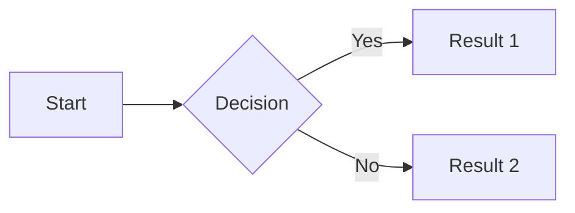

# mbr - the fast, complete markdown browser

**THIS IS A WORK IN PROGRESS AND NOT YET STABLE** but testers are welcome.

This is inspired by tools like [Marked 2](https://marked2app.com), [Zola](https://www.getzola.org), [mdbook](https://github.com/rust-lang/mdBook), and [Obsidian Publish](https://obsidian.md/publish).

The goal of this is to preview markdown under an assumption that there are other markdown files around and we want to be able to jump around between them by following links, browsing tags, browsing folders, and searching. Ultimately, things like backlinks, in-document table of contents, and more will be available.  So first it's a markdown previewer, but then a markdown browser for navigating markdown files. And finally, I want it to be an optional static site generator.

A key principle is that any given repo of markdown files can have its UI/UX be customizable including styles, themes, and even functionality.  Users customize by creating a `.mbr/` folder in the root of their markdown file project.  Inside that, there can be a `config.toml` file for customizing, though it isn't required.  All javascript, css, and html components are fetched from a URL that is `/.mbr/something` and it will look in the local `.mbr/` folder for the files before falling back to compiled-in defaults. There's also a command-line flag to look in an alternate location.

Another key principle is speed: rendering markdown should be almost instantaneous.  Viewing a markdown file should launch and render quickly, with progressive enhancement for other features involving search and browsing.

I've added quite a few minor markdown extensions. For example, if an image link (``) points to something other than an image, like an audio file, video file, or pdf, then we will provide the appropriate embedding. Bare links on their own lines will be enriched oembed-style.  Because some of my note repos have a lot of other assets, managing these is also of great importance.

While I want to use this first and foremost as a markdown previewer with live updating, and second as a markdown browser, the whole thing is HTML-centric. This means that it is a short extra distance to be able to generate a static website and because there are no other static site generators that meet my various criteria (ability to blend assets with markdown in the same folders, no required directory structures, enriched markdown, fast, handling of videos, and more).

## Approach

1. Markdown will convert to HTML on the fly
2. HTML will be served up from a local private web server
3. The UI is HTML+JavaScript+CSS with Lit web components
4. Everything (style, behavior, html, components) is highly configurable and selectively overrideable
5. Performance is extremely important -- for launch of GUI and server, render of a markdown, build of a site, and for built sites, loading and rendering in a browser.
6. Leaves nothing behind (no caches, temp files, etc.), unless there's a static build and even then, only in the build directory.

## Installation

### Using Nix (Recommended)

```bash
# Run directly without installing
nix run github:zmre/mbr -- -s /path/to/your/notes

# Build and install
nix build github:zmre/mbr
./result/bin/mbr -g /path/to/your/notes

# Add to your flake
{
  inputs.mbr.url = "github:zmre/mbr";
}
# Then use inputs.mbr.packages.${system}.default
```

### Using Cargo

```bash
cargo install --git https://github.com/zmre/mbr
```

## Running

Specify a markdown file or directory to start:

```bash
# Print rendered HTML to stdout
mbr README.md

# Start web server at http://127.0.0.1:5200/
mbr -s /path/to/notes

# Launch native GUI window with web server
mbr -g /path/to/notes

# Generate static site to ./build folder
mbr -b /path/to/notes

# Generate static site to custom output folder
mbr -b --output ./public /path/to/notes
```


## Developing

See [DEVELOP](DEVELOP.md)

## Markdown Extensions

mbr extends standard markdown with several features for richer content.

### Github Extensions

mbr uses [pulldown-cmark](https://github.com/raphlinus/pulldown-cmark) with all extensions enabled:

| Extension | Syntax | Example |
|-----------|--------|---------|
| Tables | GFM tables | `| Col1 | Col2 |` |
| Footnotes | `[^1]` references | `Text[^1]` with `[^1]: footnote` |
| Strikethrough | `~~text~~` | ~~deleted~~ |
| Task lists | `- [ ]` / `- [x]` | Checkboxes in lists |
| Smart punctuation | `"quotes"`, `--` | Curly quotes, em-dashes |
| Heading attributes | `# Title {#id}` | Custom anchor IDs |
| YAML frontmatter | `---` blocks | Metadata at file start |
| Autolinks | `<https://...>` | Auto-linked URLs |

### YAML Frontmatter

Add metadata at the start of any markdown file and it becomes searchable and navigable:

```yaml
---
title: My Document
tags: documentation, guide
author: Your Name
---
```

### Task Lists with addition of Canceled Items

In addition to standard `[ ]` and `[x]` checkboxes, mbr supports canceled items:

```markdown
- [ ] Unchecked task
- [x] Completed task
- [-] Canceled task (renders with strikethrough)
```

### Mermaid Diagrams

Code blocks with the `mermaid` language are rendered as diagrams:

````markdown

````

### Media Embedding via Image Syntax

Use standard image syntax `` to embed various media types:

**Video files** (mp4, mpg, avi, ogv, ogg, m4v), optionally with start and end timestamps:

```markdown


```

**Audio files** (mp3, wav, ogg, flac, aac, m4a, webm):
```markdown

```

**YouTube videos** (various URL formats supported):
```markdown


```

**PDF documents**:
```markdown

```

Regular images (jpg, png, gif, etc.) render normally as images.

### Enriched Bare URLs

Bare URLs on their own line are enriched with OpenGraph metadata when available:

```markdown
Some text here.

https://example.com/article

More text here.
```

This fetches the page's title, description, and image to create a rich preview card. YouTube URLs get full video embeds.

### GitHub-style Alerts

Use GitHub's alert syntax for callout boxes:

```markdown
> [!NOTE]
> Helpful information that users should know.

> [!TIP]
> Optional advice to help users succeed.

> [!IMPORTANT]
> Key information users need to know.

> [!WARNING]
> Urgent info that needs immediate attention.

> [!CAUTION]
> Advises about risks or negative outcomes.
```

Each alert type has distinct colors and icons.

### Pull Quotes

Use double `>>` for magazine-style pull quotes with emphasized styling:

```markdown
Regular paragraph text here.

>> This important quote stands out from the surrounding text with larger, italic styling and a prominent border.

More regular text continues here.
```

Pull quotes by default render with larger font size, italic text, and a distinctive left border.

### Marginalia (Sidenotes)

Use triple `>>>` for margin notes that appear in margins on wide screens or as hover/click popovers on narrower screens:

```markdown
Main paragraph text that readers focus on.

>>> This aside provides supplementary context without interrupting the main flow.

Continuation of the main content.
```

Marginalia appear as a dagger symbol (†) to the right. Hover or tap reveals the note content in a popover. The `>>>` syntax must be on its own line with blank lines before and after.

## TODO

See [TODO](TODO.md)
