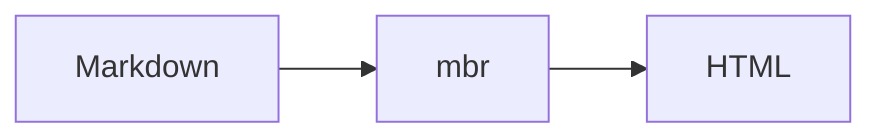

<div align="center">

# 

**The fast, complete markdown browser and static site generator**

[](https://github.com/zmre/mbr-markdown-browser/releases)
  
  
  [](LICENSE)

</div>

---

## Why mbr?

> **No custom syntax. No required directory structures. Just markdown.**

Most static site generators force you into their world: custom folder layouts, proprietary frontmatter, bespoke shortcodes. mbr takes a different approach. Point it at any collection of markdown files and it just works for previewing a single file, browsing thousands of notes, or building a deployable website.

And unlike other markdown previewers, this one allows quick navigation between markdown files.

## Features

| Feature | Description |
|---------|-------------|
| **Instant Preview** | Sub-second markdown rendering with live reload |
| **Native GUI** | macOS/Linux app with native menus and shortcuts (Windows should work, but is untested) |
| **Static Sites** | Generate deployable websites with full-text search |
| **Smart Navigation** | Browse by folders, tags, recents, and full-text search |
| **Keyboard Friendly** | Vim-like shortcuts are available for everything in the UI |
| **Rich Media** | Embed videos, audio, PDFs, and YouTube with simple markdown standard syntax |
| **Fully Customizable** | Override themes, templates, and UX per-repo |

## Quick Start

### Install

```bash
# Using Nix to quick run without installing
nix run github:zmre/mbr -- -g /path/to/notes

# Using Cargo
cargo install --git https://github.com/zmre/mbr
```

_File an issue if you want it packaged in a particular way._

### Run

```bash
mbr README.md         # Render to stdout
mbr -s ~/notes        # Start web server at http://127.0.0.1:5200/
mbr -g ~/notes        # Launch native GUI window
mbr -b ~/notes        # Build static site to ./build/
```

## Documentation

See the [full documentation](https://zmre.github.io/mbr/) for detailed guides. The documentation site itself is built with mbr, serving as a live example of its capabilities.

- [Getting Started](https://zmre.github.io/mbr/getting-started/) - Installation and first steps
- [Modes of Operation](https://zmre.github.io/mbr/modes/) - GUI, Server, Build, and QuickLook
- [Customization](https://zmre.github.io/mbr/customization/) - Themes, templates, and components
- [Markdown Extensions](https://zmre.github.io/mbr/markdown/) - Extended syntax reference
- [Architecture](https://zmre.github.io/mbr/reference/architecture/) - Technical overview
- [Development](https://zmre.github.io/mbr/reference/development/) - Building and contributing

## Markdown Extensions

mbr extends standard markdown with powerful features:

### Rich Media Embedding

Use image syntax to embed any media type:

```markdown
              # Video with controls
              # Audio player
              # PDF viewer
     # YouTube embed
```

### GitHub-style Alerts

```markdown
> [!NOTE]
> Helpful information users should know.

> [!WARNING]
> Critical information requiring attention.
```

### Pull Quotes & Marginalia

```markdown
>> This important quote stands out from surrounding text.

>>> This sidenote appears in the margin on wide screens.
```

### Mermaid Diagrams

````markdown

````

### YAML Frontmatter

```yaml
---
title: My Document
tags: guide, documentation
---
```

## Customization

Create a `.mbr/` folder in your markdown repository to customize:

```
.mbr/
├── config.toml    # Configuration
├── theme.css      # Color theme
├── user.css       # Additional styles
├── index.html     # Page template
└── components/    # Custom web components
```

See the [customization guide](https://zmre.github.io/mbr/customization/) for details.

## License

MIT - see [LICENSE](LICENSE) for details.