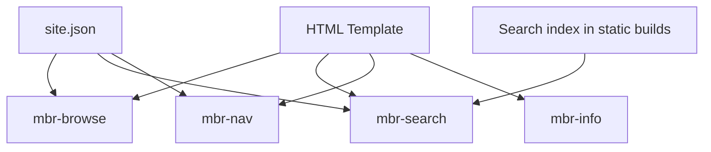

# Web Components

mbr uses [Lit](https://lit.dev/) web components for interactive features. You can override or extend these components. The reason for the components is that they're lightweight and a standard so framework code is minimal. Also a lot of other frameworks like svelte and nuxt can export their components as web components.  Plus the extensibility story is fantastic so it meets many of our requirements.

## Built-in Components

| Component | Purpose | Element |
|-----------|---------|---------|
| `mbr-browse` | File browser sidebar | `<mbr-browse>` |
| `mbr-search` | Search interface | `<mbr-search>` |
| `mbr-nav` | Next/prev buttons | `<mbr-nav>` |
| `mbr-info` | Info panel | `<mbr-info>` |
| `mbr-live-reload` | Development hot reload | `<mbr-live-reload>` |
| `mbr-video-extras` | Video player enhancements | `<mbr-video-extras>` |

## Component Architecture



Components load site metadata from `/.mbr/site.json` and render interactive UI.

## Overriding Components

At the moment, we're bundling all the components together in `mbr-components.js` -- this is efficient from a loading / speed perspective and makes current development easier. Start with the source components and make your own `mbr-components.js` for now. At some point we'll come back and make this easier to selectively override and maybe dynamically bundle and combine (or at static build time) for efficiency.

### Future: Selective Override

> ![WARN]
> Selective override can't be done as described below (yet).

To override a component, create a file in `.mbr/components/`:

```
.mbr/
└── components/
    └── mbr-browse.js    # Replaces the default mbr-browse
```

Your component must:
1. Use the same custom element name
2. Export as an ES module
3. Be compatible with browsers (no build step)

## Component Styling

Components use CSS custom properties for theming:

```css
/* .mbr/user.css */
mbr-browse {
  --mbr-browse-bg: #1a1a1a;
  --mbr-browse-width: 320px;
  --mbr-browse-padding: 1rem;
}

mbr-search {
  --mbr-search-input-bg: #fff;
  --mbr-search-result-hover: #f3f4f6;
}
```

## Creating Custom Components

### Basic Lit Component

The example below is javascript, but we exclusively use typescript and use vite to handle the transpiling and bundling.

```javascript
// .mbr/components/my-component.js
import { LitElement, html, css } from 'lit';

class MyComponent extends LitElement {
  static styles = css`
    :host {
      display: block;
      padding: 1rem;
    }
    button {
      background: var(--pico-primary);
      color: white;
      border: none;
      padding: 0.5rem 1rem;
      cursor: pointer;
    }
  `;

  static properties = {
    count: { type: Number }
  };

  constructor() {
    super();
    this.count = 0;
  }

  render() {
    return html`
      <div>
        <p>Count: ${this.count}</p>
        <button @click=${this._increment}>Increment</button>
      </div>
    `;
  }

  _increment() {
    this.count++;
  }
}

customElements.define('my-component', MyComponent);
```

Use in your template:

```html
<my-component></my-component>
```

> [!NOTE]
> When using web components, you can't use self-closing tags. You MUST ALWAYS have a full close tag.

### Accessing Site Data

Components can fetch site metadata using a shared library:

```typescript
import { subscribeSiteNav } from './shared.js'
@customElement('my-custom-browse')
export class MySiteNav extends LitElement {
  // === Data State ===
  @state()
  private _allFiles: MarkdownFile[] = [];

  @state()
  private _isLoading = true;

  @state()
  private _loadError: string | null = null;

  constructor() {
    super();
  }

  override connectedCallback() {
    super.connectedCallback();

    // Subscribe to site navigation data
    this._unsubscribeSiteNav = subscribeSiteNav((state) => {
      this._isLoading = state.isLoading;
      this._loadError = state.error;

      if (state.data?.markdown_files) {
        this._allFiles = state.data.markdown_files;

        // ...
      }
    });
  }

  override disconnectedCallback() {
    super.disconnectedCallback();
    if (this._unsubscribeSiteNav) {
      this._unsubscribeSiteNav();
    }
  }

  override render() {
    return html`
            ${this._allFiles.map(file => this._renderFile(file))}
    `;
  }

  private _renderFile(file: MarkdownFile): TemplateResult {
    const filename = file.raw_path.split('/').pop() || '';
    const title = file.frontmatter?.title ||
      file.url_path.split('/').filter(p => p).pop() || 'Untitled';
    const description = file.frontmatter?.description ||
      file.frontmatter?.summary || '';
    const tags = this._extractFileTags(file);
    const modifiedDate = this._formatDate(file.modified);
    const parentFolder = this._getParentFolder(file.url_path);

    return html`
      <a href="${file.url_path}">${file.frontmatter?title || ""}</a>
    `;
  }
}
```

## mbr-browse Component

The file browser component is the most complex. Key features:

### State Management

```javascript
// Internal state
@state() recentFiles = [];      // Recently viewed files
@state() shortcuts = [];        // User-pinned files
@state() selectedTags = [];     // Active tag filters
@state() expandedFolders = [];  // Open folder tree nodes
```

### Keyboard Navigation

```javascript
// Keyboard shortcuts
'-'       // Open browser panel
'Escape'  // Close panel
'↑/↓'     // Navigate items
'Enter'   // Select item
```

### Local Storage

The browser persists state to localStorage:

```javascript
localStorage.getItem('mbr-recent-files');   // Recent files list
localStorage.getItem('mbr-shortcuts');       // Pinned files
```

## mbr-search Component

### Server Mode

Posts search queries to the backend:

```javascript
async search(query) {
  const response = await fetch('/.mbr/search', {
    method: 'POST',
    body: JSON.stringify({ q: query })
  });
  return response.json();
}
```

### Static Mode

Uses Pagefind for client-side search:

```javascript
async search(query) {
  const pagefind = await import('/.mbr/pagefind/pagefind.js');
  await pagefind.init();
  return pagefind.search(query);
}
```

## Development Workflow

### Using Built-in Dev Server

1. Run mbr in development mode:
   ```bash
   mbr -s --template-folder ./my-templates ~/notes
   ```

2. Edit components in your template folder

3. Reload browser to see changes

### Building Components

If your components need a build step:

```bash
cd components
npm install
npm run build
cp dist/*.js ../.mbr/components/
```

### Hot Reload

During development, changes to `.mbr/` files trigger live reload automatically.

## Compatibility Notes

### Browser Support

Components must work in:
- Chrome/Edge 88+
- Firefox 78+
- Safari 14+

### ES Modules

Components are loaded as ES modules:

```html
<script type="module" src="/.mbr/components/mbr-browse.js"></script>
```

### Shadow DOM

Lit components use Shadow DOM by default. To allow external styling:

```javascript
class MyComponent extends LitElement {
  // Disable Shadow DOM
  createRenderRoot() {
    return this;
  }
}
```

Or use CSS custom properties for themeable styling.

