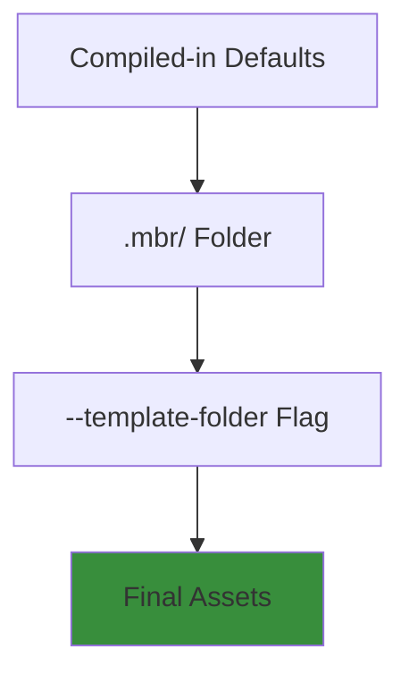

# Customization

mbr is designed to be highly customizable. Each markdown repository can have its own look and feel through a `.mbr/` configuration folder.

## The `.mbr/` Folder

To customize behavior or user experience, create a `.mbr/` folder in the root of your markdown repository:

```
your-notes/
├── .mbr/
│   ├── config.toml    # Configuration
│   ├── theme.css      # Complete theme replacement
│   ├── user.css       # Select style changes/ overrides
│   ├── index.html     # Page template
│   └── components/    # Custom components
├── README.md
└── docs/
```

## Customization Layers

Assets are resolved in this order (later overrides earlier):

1. **Compiled-in defaults** - Built into the mbr binary
2. **`.mbr/` folder** - Per-repository customization
3. **`--template-folder` flag** - Command-line override




## Customization Files

| File | Purpose | Guide |
|------|---------|-------|
| `config.toml` | Settings and behavior | [CLI Reference](../reference/cli/) |
| `theme.css` | Color theme override | [Themes](themes/) |
| `user.css` | Additional styles | [Themes](themes/) |
| `index.html` | Main page template | [Templates](templates/) |
| `section.html` | Directory listing template | [Templates](templates/) |
| `home.html` | Home page template | [Templates](templates/) |
| `_*.html` | Partial templates | [Templates](templates/) |
| `components/*.js` | Custom web components | [Components](components/) |

## Quick Customization Examples

### Change Primary Color

```css
/* .mbr/user.css */
:root {
  --pico-primary: #8B5CF6;
  --pico-primary-hover: #7C3AED;
}
```

### Add Custom Footer

```html
<!-- .mbr/_footer.html -->
<footer>
  <p>© 2025 Your Name. Built with mbr.</p>
</footer>
```

### Configure Ignored Directories

```toml
# .mbr/config.toml
ignore_dirs = ["private", "drafts", "node_modules"]
```

## Development Workflow

When developing custom themes or templates:

1. Start the server: `mbr -s ~/notes`
2. Edit files in `.mbr/`
3. Save and refresh the browser

For template development, use the `--template-folder` flag to point at an external folder:

```bash
mbr -s --template-folder ./my-templates ~/notes
```

This lets you share templates or work on ones in their own repository for sharing across markdown repos.

## Guides

- [CSS Theming](themes/) - Colors, fonts, and styles
- [HTML Templates](templates/) - Page structure and layout
- [Web Components](components/) - Interactive elements
