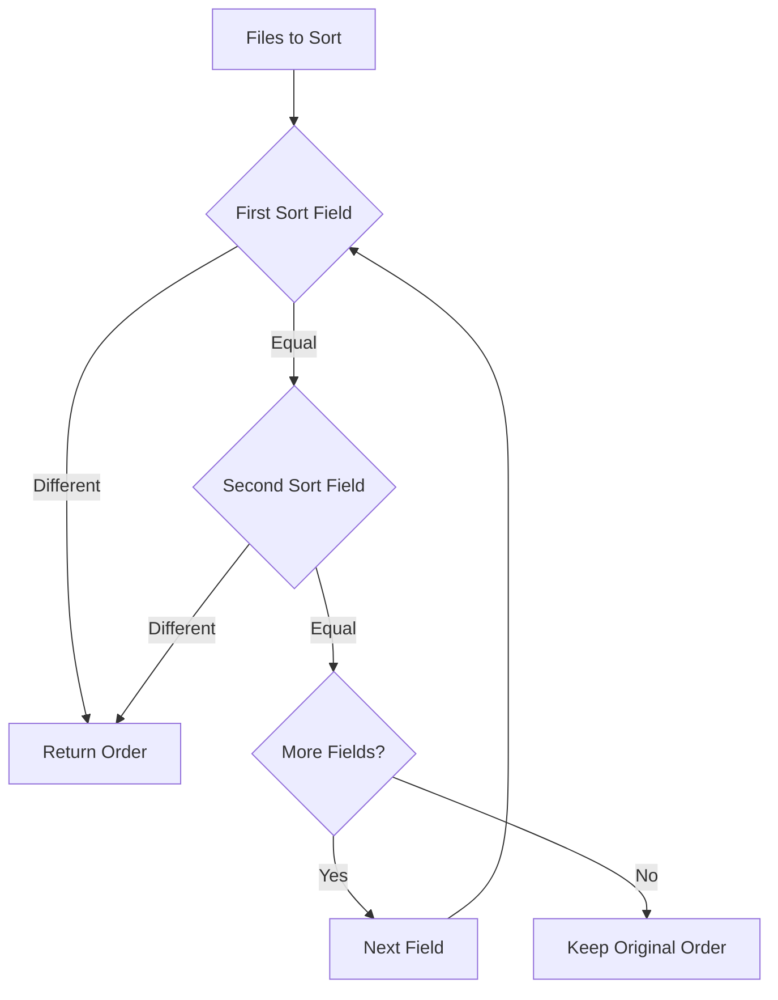

# File Sorting

mbr supports configurable multi-level sorting for file listings in the browser sidebar and section pages.

## Default Behavior

By default, files are sorted alphabetically by title (falling back to filename if no title is set).

## Configuration

Configure sorting in `.mbr/config.toml` using the `[[sort]]` array:

```toml
[[sort]]
field = "order"
order = "asc"
compare = "numeric"

[[sort]]
field = "title"
order = "asc"
compare = "string"
```

### Sort Field Options

| Option | Values | Default | Description |
|--------|--------|---------|-------------|
| `field` | Any string | `"title"` | Field to sort by |
| `order` | `"asc"`, `"desc"` | `"asc"` | Sort direction |
| `compare` | `"string"`, `"numeric"` | `"string"` | Comparison type |

### Built-in Fields

| Field | Description |
|-------|-------------|
| `title` | Frontmatter title, falls back to filename |
| `filename` | Raw filename |
| `created` | File creation timestamp |
| `modified` | File modification timestamp |

Any other field name is looked up in the file's frontmatter.

## Multi-Level Sorting

Sort criteria are evaluated in order. The first non-equal comparison determines the order. This enables patterns like:

- Sort by `order`, then by `title` for ties
- Sort by `pinned` status, then by `modified` date

## Missing Value Behavior

Files missing a sort field are placed **after** files that have it. This enables useful patterns:

### Documentation Ordering

Add an `order` field to control page sequence:

```yaml
---
title: Getting Started
order: 1
---
```

Files without `order` appear after ordered files.

### Pinned Items

Pin important items to the top:

```yaml
---
title: Important Announcement
pinned: true
---
```

```toml
# .mbr/config.toml
[[sort]]
field = "pinned"
order = "desc"
compare = "numeric"

[[sort]]
field = "modified"
order = "desc"
compare = "numeric"
```

Pinned items appear first (boolean `true` = 1, `false` = 0), then remaining items by modification date.

## Examples

### Blog (Newest First)

```toml
[[sort]]
field = "modified"
order = "desc"
compare = "numeric"
```

### Wiki (Alphabetical)

```toml
[[sort]]
field = "title"
order = "asc"
compare = "string"
```

### Documentation (Ordered Sections)

```toml
[[sort]]
field = "order"
order = "asc"
compare = "numeric"

[[sort]]
field = "title"
order = "asc"
compare = "string"
```

### Priority Queue

```toml
[[sort]]
field = "priority"
order = "desc"
compare = "numeric"

[[sort]]
field = "title"
order = "asc"
compare = "string"
```

## How It Works



For each pair of files, sort fields are compared in order until a difference is found. Files missing a field value are placed after files with values.
