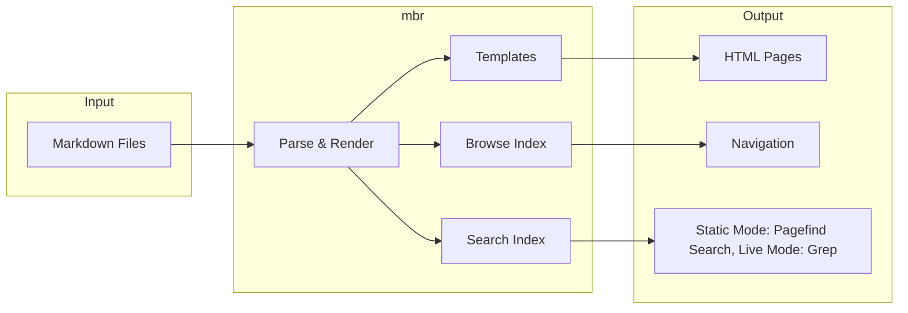

# mbr - Markdown Browser Documentation


**mbr** is a fast tool for browsing, previewing, and publishing markdown. Point it at any collection of markdown files - no custom syntax or directory structures required.

> [!NOTE]
> This documentation site is built with mbr. It serves as a live example of mbr's features including navigation like browsing and searching, and extended syntax like mermaid diagrams and embedded media. Browse around to see mbr in action. Hit minus (`-`) or click the hamburger icon in the top left to browse or hit slash (`/`) to search.

## Quick Links

| Section | Description |
|---------|-------------|
| [Getting Started](getting-started/) | Installation and first steps |
| [Modes of Operation](modes/) | GUI, Server, Build, and QuickLook |
| [Customization](customization/) | Themes, templates, and components |
| [Markdown Extensions](markdown/) | Extended syntax reference |
| [CLI Reference](reference/cli/) | Command line options |
| [Architecture](reference/architecture/) | Technical overview |
| [Development](reference/development/) | Building and contributing |

## What is mbr?

mbr is three tools in one:

1. **Markdown Previewer** - Render any markdown file instantly with live reload
2. **Markdown Browser** - Navigate folders, tags, and search across thousands of files
3. **Static Site Generator** - Build deployable websites with full-text search

### Key Principles

https://media1.giphy.com/media/v1.Y2lkPTc5MGI3NjExbG5udXhqcWpseDgyaGJ2bDd0MXRqYWVqYnY0b2MyMjRsbzU5cng5OSZlcD12MV9pbnRlcm5hbF9naWZfYnlfaWQmY3Q9Zw/izspP6uMbMeti/giphy.gif

- **Speed** - Sub-second rendering, instant navigation, fast site builds
- **No lock-in** - Works with any markdown repository without modifications
- **Customizable** - Override styles, templates, and components per-repository
- **Rich content** - Embed videos, audio, PDFs, diagrams, and more

### Navigation Features

- **File Browser** - Press `-` to open a sidebar with shortcuts, recent files, tag tree, and folder navigation
- **Full-Text Search** - Press `/` to search across all files instantly
- **Tag Hierarchy** - Nested tags like `project/frontend` create browsable trees
- **Breadcrumbs** - Navigate up through the directory structure
- **Next/Prev** - Press `L` to go to the next file and `H` to go to the previous one
- **Info** - Press `Ctrl-g` to open an info window showing table of contents and frontmatter

## How It Works

Previewing: the mbr binary has built-in html template, css, and javascript defaults that are combined with html that derives from the current markdown file.  For any given repository of markdown files, there's a check for a `.mbr/` folder. The html templates, css, and javascript are fetched from there if they exist and fall back to the built-in defaults if they don't.

Exploring: in live mode (server or GUI), an initial file is rendered and in the background, an index of markdown files, assets, and metadata for each file (including frontmatter) is compiled and loaded into the GUI browser window.  That info is stored as a JSON file in a static build.  Also in static builds, full content search indices are generated, while in server and GUI mode content searches grep through files.



## Quick Example

```bash
# Preview a single file
mbr README.md

# Browse your notes with a web server
mbr -s ~/notes

# Launch a native GUI window
mbr -g ~/notes

# Build a static site
mbr -b ~/notes
```

## Customization at a Glance

Optionally create a `.mbr/` folder in your markdown repository to customize how a given repository is handled and presented:

```
your-notes/
├── .mbr/
│   ├── config.toml    # Configuration
│   ├── theme.css      # Replace the default theme
│   └── user.css       # Add or override select styles
├── whatever.md
└── subdir/
    └── important-note.md
```

See [Customization](customization/) for the full guide.
