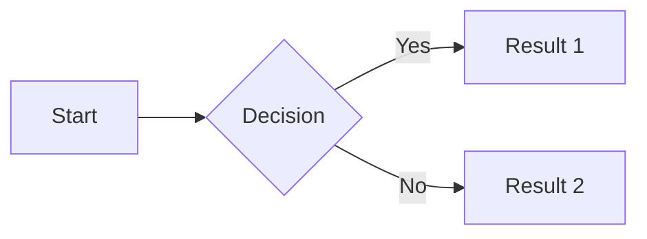

# Markdown Extensions

mbr uses [pulldown-cmark](https://github.com/raphlinus/pulldown-cmark) with all extensions enabled, plus additional features for richer content.

## Standard Extensions

These are pulldown-cmark's built-in extensions:

| Extension | Syntax | Example |
|-----------|--------|---------|
| [Tables](https://pulldown-cmark.github.io/pulldown-cmark/third_party/gfm_table.html) | GFM tables | `\| Col1 \| Col2 \|` |
| [Footnotes](https://pulldown-cmark.github.io/pulldown-cmark/specs/footnotes.html) | `[^1]` references | `Text[^1]` + `[^1]: Note` |
| [Strikethrough](https://pulldown-cmark.github.io/pulldown-cmark/third_party/gfm_strikethrough.html) | `~~text~~` | ~~deleted text~~ |
| [Task lists](https://pulldown-cmark.github.io/pulldown-cmark/third_party/gfm_tasklist.html) | `- [ ]` / `- [x]` | Checkboxes in lists |
| [Smart punctuation](https://pulldown-cmark.github.io/pulldown-cmark/third_party/smart_punct.html) | `"quotes"`, `--` | Curly quotes, em-dashes |
| [Heading attributes](https://pulldown-cmark.github.io/pulldown-cmark/specs/heading_attrs.html) | `# Title {#id}` or `# Title {.myclass}` | Custom anchor IDs or classes |
| Autolinks | `<https://...>` | Clickable URLs |
| [Math](https://pulldown-cmark.github.io/pulldown-cmark/specs/math.html) | `$...$` / `$$...$$` | LaTeX via KaTeX |
| [Wikilinks](https://pulldown-cmark.github.io/pulldown-cmark/specs/wikilinks.html) | `[[Doc Filename]]` | Links to "Doc Filename.md" |

## YAML Frontmatter

Add metadata to any markdown file:

```yaml
---
title: My Document
description: A helpful guide
tags: documentation, guide
date: 2025-01-09
author: Your Name
custom_field: Any value
---

# Content starts here
```

### Using Frontmatter

Frontmatter powers:
- **Page titles**: Browser tab and heading
- **Descriptions**: Search results and previews
- **Tags**: Navigation and filtering
- **Custom fields**: Available in templates

### Supported Fields

| Field | Purpose |
|-------|---------|
| `title` | Page title |
| `description` | Meta description |
| `tags` | Comma-separated tags |
| `date` | Publication date |
| `author` | Author name |
| Any field | Available via `frontmatter_json` |

## GitHub-style Alerts

Use callout boxes for important information:

```markdown
> [!NOTE]
> Helpful information that users should know.
```

Available box types: `[!NOTE]`, [!TIP], `[!IMPORTANT]`, `[!WARNING]`, `[!CAUTION]`.
`

### Live Examples

> [!NOTE]
> Helpful information that users should know, like tips for getting the most out of mbr.

> [!TIP]
> Optional advice to help users succeed. Try pressing `-` to open the file browser!

> [!IMPORTANT]
> Key information users need to know. mbr requires no special directory structure.

> [!WARNING]
> Urgent info that needs immediate attention. Back up your files before bulk operations.

> [!CAUTION]
> Advises about risks or negative outcomes. Running with `--template-folder` overrides local `.mbr/` settings.

## Canceled Task Items

In addition to standard checkboxes, mbr supports canceled items:

```markdown
- [ ] Unchecked task
- [x] Completed task
- [-] Canceled task
```

### Live Example

- [ ] Write documentation
- [x] Set up project structure
- [-] Use complex build system (not needed!)

## Pull Quotes

Use double `>>` for emphasized quotations:

```markdown
>> This important quote stands out from the surrounding text.
```

### Live Example

>> The goal of mbr is simple: take any collection of markdown files and make them instantly browsable, searchable, and publishable -- without requiring special syntax or directory structures.

Pull quotes render with larger font size, italic styling, and a distinctive left border.

## Marginalia (Sidenotes)

On wide screens, marginalia appear in the right margin. On narrow screens, they appear as a dagger (†) that reveals content on hover/click.

Use triple `>>>` for margin notes:

```markdown
Main paragraph text that readers focus on.

>>> This aside provides supplementary context.

Continuation of the main content.
```

### Live Example

mbr's marginalia feature is inspired by Tufte CSS and academic publishing traditions where sidenotes provide additional context without interrupting the flow of the main text.

>>> Edward Tufte popularized sidenotes in his books on data visualization. They allow readers to absorb supplementary information at their own pace.


## Mermaid Diagrams

Code blocks with `mermaid` language render as diagrams:

````markdown

````

Renders as:


### Supported Diagram Types

- Flowcharts (`graph` or `flowchart`)
- Sequence diagrams (`sequenceDiagram`)
- Class diagrams (`classDiagram`)
- State diagrams (`stateDiagram`)
- Gantt charts (`gantt`)
- Pie charts (`pie`)
- And more...

See [Mermaid documentation](https://mermaid.js.org/) for full syntax.

## Math with KaTeX

mbr supports mathematical notation using [KaTeX](https://katex.org/), rendered from LaTeX syntax.

### Inline Math

Wrap expressions in single dollar signs for inline math:

```markdown
The quadratic formula is $x = \frac{-b \pm \sqrt{b^2 - 4ac}}{2a}$ which solves $ax^2 + bx + c = 0$.
```

Renders as: The quadratic formula is $x = \frac{-b \pm \sqrt{b^2 - 4ac}}{2a}$ which solves $ax^2 + bx + c = 0$.

### Display Math

Use double dollar signs for block-level equations:

```markdown
$$
\int_{-\infty}^{\infty} e^{-x^2} dx = \sqrt{\pi}
$$
```

Renders as:

$$
\int_{-\infty}^{\infty} e^{-x^2} dx = \sqrt{\pi}
$$

### More Examples

**Matrices:**

$$
\begin{pmatrix}
a & b \\
c & d
\end{pmatrix}
\begin{pmatrix}
x \\
y
\end{pmatrix} =
\begin{pmatrix}
ax + by \\
cx + dy
\end{pmatrix}
$$

**Summations and products:**

$$
\sum_{n=1}^{\infty} \frac{1}{n^2} = \frac{\pi^2}{6}
$$

See the [KaTeX documentation](https://katex.org/docs/supported.html) for the full list of supported LaTeX commands.

## Syntax Highlighting

Code blocks are highlighted using highlight.js:

### Live Examples

```rust
fn main() {
    let message = "Hello from mbr!";
    println!("{}", message);
}
```

```python
def greet(name: str) -> str:
    """Return a friendly greeting."""
    return f"Hello, {name}!"
```

```javascript
const render = async (markdown) => {
  const html = await mbr.parse(markdown);
  document.body.innerHTML = html;
};
```

### Supported Languages

`bash`, `javascript`, `typescript`, `python`, `ruby`, `rust`, `go`, `java`, `json`, `yaml`, `toml`, `html`, `css`, `sql`, `markdown`, and many more.

## Tables

GFM-style tables with alignment:

```markdown
| Left | Center | Right |
|:-----|:------:|------:|
| A    |   B    |     C |
| D    |   E    |     F |
```

| Left | Center | Right |
|:-----|:------:|------:|
| A    |   B    |     C |
| D    |   E    |     F |

## Footnotes

Add references that link to notes:

```markdown
Here is a statement that needs citation[^1].

[^1]: This is the footnote content.
```

### Live Example

mbr uses pulldown-cmark for markdown parsing[^1], which provides excellent CommonMark compliance and performance[^2].

Footnotes appear at the bottom of the page.

## Heading Anchors

Headers automatically get anchor IDs:

```markdown
## My Section
```

Links to `#my-section`. Override with explicit IDs:

```markdown
## My Section {#custom-id}
```

## Section Attributes

When `enable_sections` is active (default for server/GUI mode), horizontal rules (`---`) divide content into `<section>` elements. You can add attributes to the **following** section by placing an attribute block after the rule:

```markdown
--- {#intro .highlight}

This content is in a section with id="intro" and class="highlight".

--- {.slide data-transition="fade"}

This section has class="slide" and a custom data attribute.

---

Plain section (no attributes).
```

### Attribute Syntax

The attribute block follows [pulldown-cmark's heading attributes syntax](https://pulldown-cmark.github.io/pulldown-cmark/specs/heading_attrs.html):

| Syntax | Result | Example |
|--------|--------|---------|
| `#id` | ID attribute | `{#intro}` → `id="intro"` |
| `.class` | CSS class | `{.highlight}` → `class="highlight"` |
| `key=value` | Custom attribute | `{data-x=y}` → `data-x="y"` |
| `key="value"` | Quoted value | `{title="Hello World"}` |

Multiple attributes can be combined:

```markdown
--- {#section-1 .slide .center data-transition="slide" data-background="#fff"}
```

### Use Cases

**Presentation slides:** Add Reveal.js-style attributes for slide transitions and backgrounds.

**Styling:** Target specific sections with CSS using IDs or classes.

**JavaScript hooks:** Add data attributes for interactive behavior.

### Live Example

--- {#demo-section .highlighted-section}

This section has `id="demo-section"` and `class="highlighted-section"`. Inspect the HTML to verify!

---

Back to a plain section.

## Auto-linking

URLs in angle brackets become clickable:

```markdown
<https://example.com>
<user@example.com>
```

## See Also

- [Media Embedding](media/) - Videos, audio, PDFs, and more
- [Presentation Slides](slides/) - Create slide presentations from markdown
- [Slides Example](test-slides/) - A live example presentation


## Footnotes

[^1]: pulldown-cmark is a Rust library that parses markdown to events, allowing flexible rendering.

[^2]: The library uses SIMD optimizations for faster text processing.

