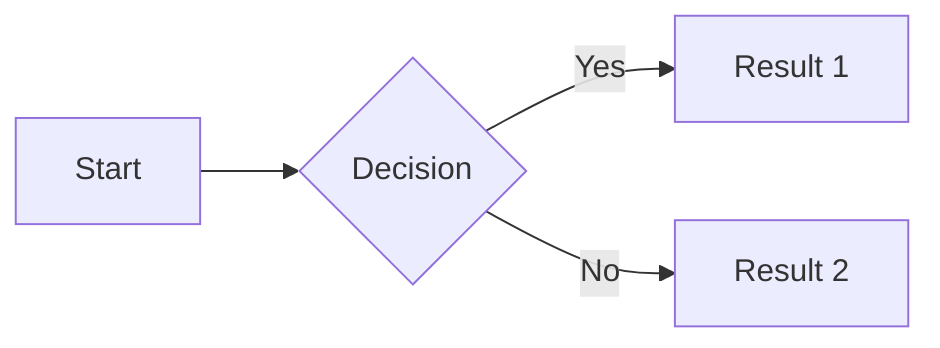

# Markdown Extensions

mbr uses [pulldown-cmark](https://github.com/raphlinus/pulldown-cmark) with all extensions enabled, plus additional features for richer content.

## Standard Extensions

These are pulldown-cmark's built-in extensions:

| Extension | Syntax | Example |
|-----------|--------|---------|
| [Tables](https://pulldown-cmark.github.io/pulldown-cmark/third_party/gfm_table.html) | GFM tables | `\| Col1 \| Col2 \|` |
| [Footnotes](https://pulldown-cmark.github.io/pulldown-cmark/specs/footnotes.html) | `[^1]` references | `Text[^1]` + `[^1]: Note` |
| [Strikethrough](https://pulldown-cmark.github.io/pulldown-cmark/third_party/gfm_strikethrough.html) | `~~text~~` | ~~deleted text~~ |
| [Task lists](https://pulldown-cmark.github.io/pulldown-cmark/third_party/gfm_tasklist.html) | `- [ ]` / `- [x]` | Checkboxes in lists |
| [Smart punctuation](https://pulldown-cmark.github.io/pulldown-cmark/third_party/smart_punct.html) | `"quotes"`, `--` | Curly quotes, em-dashes |
| [Heading attributes](https://pulldown-cmark.github.io/pulldown-cmark/specs/heading_attrs.html) | `# Title {#id}` or `# Title {.myclass}` | Custom anchor IDs or classes |
| Definition lists | `Term` on one line, `: Definition` on the next | Rendered as a [click-to-expand FAQ](#definition-lists-faq-style) |
| Autolinks | `<https://...>` | Clickable URLs |
| [Math](https://pulldown-cmark.github.io/pulldown-cmark/specs/math.html) | `$...$` / `$$...$$` | LaTeX via KaTeX |
| [Wikilinks](https://pulldown-cmark.github.io/pulldown-cmark/specs/wikilinks.html) | `[[Doc Filename]]` | Links to "Doc Filename.md" — resolved in the **current folder first**, otherwise the first match in **any** folder (Obsidian-style) |

When several notes answer to one wikilink name, mbr picks the first
(lexicographically smallest URL) and reports the ambiguity in the page-problems
panel of the page containing the link — the only place that can say which note
*that* link reached, since resolution is current-folder first. See
[Data problems mbr reports](relationships/#data-problems-mbr-reports).

## YAML Frontmatter

Add metadata to any markdown file:

```yaml
---
title: My Document
description: A helpful guide
tags: documentation, guide
date: 2025-01-09
author: Your Name
custom_field: Any value
---

# Content starts here
```

### Using Frontmatter

Frontmatter powers:
- **Page titles**: Browser tab and heading
- **Descriptions**: Search results and previews
- **Tags**: Navigation and filtering
- **Custom fields**: Available in templates
- **Special page types**: like [slides](slides/) or [person](relationships/)
- **Page styles**: `style` and `type` set the [body class](styles/) that restyles the whole page

### Supported Fields

| Field | Purpose |
|-------|---------|
| `title` | Page title |
| `description` | Meta description |
| `tags` | Comma-separated tags |
| `date` | Publication date |
| `author` | Author name |
| `type` | Note type; also becomes a [body class](styles/) |
| `style` | Display [style(s)](styles/) applied as body classes |
| Any field | Available via `frontmatter_json` |

## GitHub-style Alerts

Use callout boxes for important information:

```markdown
> [!NOTE]
> Helpful information that users should know.
```

Available box types: `[!NOTE]`, `[!TIP]`, `[!IMPORTANT]`, `[!WARNING]`, `[!CAUTION]`.
`

### Live Examples

> [!NOTE]
> Helpful information that users should know, like tips for getting the most out of mbr.

> [!TIP]
> Optional advice to help users succeed. Try pressing `-` to open the file browser!

> [!IMPORTANT]
> Key information users need to know. mbr requires no special directory structure.

> [!WARNING]
> Urgent info that needs immediate attention. Back up your files before bulk operations.

> [!CAUTION]
> Advises about risks or negative outcomes. Running with `--template-folder` overrides local `.mbr/` settings.

### remark-hint Shorthand

mbr also recognizes the [remark-hint](https://github.com/sergioramos/remark-hint) shorthand. A paragraph that begins with one of these markers is rendered as the matching GitHub-style alert, with the marker stripped from the displayed text:

| Marker | Renders as |
|--------|-----------|
| `!> ` | Tip |
| `?> ` | Warning |
| `x> ` | Caution |

```markdown
!> A helpful tip.
?> Something to watch out for.
x> A risky operation.
```

This shorthand is always on (no configuration required). The marker must appear at the very start of a paragraph and be followed by a space; otherwise the text is left untouched.

## Tasks

mbr extends GitHub's task lists with two extra markers and a small set of
annotations, all of which render as chips, pills and dots rather than as raw
text. The same syntax feeds the [task browser](tasks/), which finds
every task in the repository and lets you filter and group them.

### Markers

| Marker | Status | Meaning |
|--------|--------|---------|
| `- [ ]` | Open | Not done yet |
| `- [x]` | Done | Completed (`- [X]` works too) |
| `- [-]` | Canceled | Abandoned — struck through, and never counted in a progress bar |
| `- [>]` | Canceled | Moved somewhere else; see [move markers](#move-markers) |

Any list bullet works — `-`, `*`, `+`, `1.` or `1)` — and a task may be
indented under another one. Nested tasks are treated as independent tasks: mbr
does not roll a parent's progress up from its children.

```markdown
- [ ] Unchecked task
- [x] Completed task
- [-] Canceled task
* [ ] Parent task
	* [ ] A subtask, counted on its own
```

### Live Example

- [ ] Write documentation
- [x] Set up project structure
- [-] Use complex build system (not needed!)

### Annotations

Annotations may appear anywhere in a task's text. They are lifted out of the
displayed text and rendered as their own elements, so the line stays readable.

| Syntax | Meaning | Notes |
|--------|---------|-------|
| `@due(<date>)` | Due date | Rendered as a 🗓 chip |
| `@done(<date>)` | Completion time | Rendered as a ✓ chip |
| `#tag` | Tag | `A–Z`, `a–z`, `0–9`, `_` and `-`; must follow a space or start the text |
| `!!` | High priority | An orange dot |
| `!!!` | Urgent | A red dot; wins over `!!` |

```markdown
- [ ] Write the report !! #work @due(2026-08-05)
- [x] File the receipts #admin @done(2026-08-04 12:11 PM)
- [ ] Ship the release !!! #release @due(2026-08-04 15:00)
```

Live:

- [ ] Write the report !! #work @due(2026-08-05)
- [x] File the receipts #admin @done(2026-08-04 12:11 PM)
- [ ] Ship the release !!! #release @due(2026-08-04 15:00)

A few rules worth knowing:

- **`#tag` needs whitespace in front of it.** That is what keeps
  `page.md#anchor` from becoming a tag.
- **`!!` needs whitespace on both sides** (or the end of the line), so `wow!!`
  is emphasis, not a priority.
- **A tag is one word.** `#in-progress` and `#in_progress` are tags;
  `#in progress` is the tag `#in` followed by the word "progress".
- **There is no low priority.** Normal is the default and draws no dot.

### Date formats

`@due(...)` and `@done(...)` take the same grammar:

| Form | Example |
|------|---------|
| Date only | `@due(2026-08-05)` |
| Date + 24-hour time | `@due(2026-08-05 15:00)` |
| Date + 12-hour time | `@due(2026-08-05 03:00 PM)` |

Dates are **naive and local**: mbr does no timezone conversion and no UTC
round trip, so `2026-08-05 09:00` means nine in the morning wherever you are.
A due date with no time is treated as the start of that day, and a task is
overdue only once that whole day has passed — a task due today at 09:00 still
reads as "Today" at five in the afternoon.

> [!NOTE]
> An annotation whose contents are not a date is **not** an annotation.
> `@due(next tuesday)` stays in the text exactly as written, so a mistyped date
> shows up as your typo rather than as a task that quietly lost its deadline.

### Move markers

When a task moves to another note — most often a dated daily note — record
where it went with a trailing `> DATE`, and where it came from with a trailing
`< DATE`:

```markdown
- [>] Draft the agenda > 2026-08-06
- [ ] Draft the agenda < 2026-08-04
```

Both markers are stripped from the displayed text. The `>` form marks the task
canceled (it lives somewhere else now) and its destination date is kept and
shown as a → chip; the `<` form is recognised only so it does not clutter the
display, and is otherwise discarded.

### Where tasks are and are not found

The task browser scans markdown files line by line and skips fenced code
blocks, indented code blocks, HTML blocks and YAML frontmatter — so a `- [ ]`
inside an example like the ones above is documentation, not a task.

### Editing tasks

With [editing](../modes/editing/) enabled, checkboxes in a rendered page become
clickable: a left click completes or reopens a task, and a right click cancels
it. Only the marker byte (and the `@done(...)` stamp) is rewritten; your
indentation, bullet style, spacing, other annotations and line endings are left
exactly as you wrote them. See the
[task browser](tasks/#toggling-a-task) for the same thing from the
panel, and
[`tasks_stamp_done`](../reference/configuration/#task-settings) for the stamp.

## Pull Quotes

Use double `>>` for emphasized quotations:

```markdown
>> This important quote stands out from the surrounding text.
```

### Live Example

>> The goal of mbr is simple: take any collection of markdown files and make them instantly browsable, searchable, and publishable -- without requiring special syntax or directory structures.

Pull quotes render with larger font size, italic styling, and a distinctive left border.

## Marginalia (Sidenotes)

On wide screens, marginalia appear in the right margin. On narrow screens, they appear as a dagger (†) that reveals content on hover/click.

Use triple `>>>` for margin notes:

```markdown
Main paragraph text that readers focus on.

>>> This aside provides supplementary context.

Continuation of the main content.
```

### Live Example

mbr's marginalia feature is inspired by Tufte CSS and academic publishing traditions where sidenotes provide additional context without interrupting the flow of the main text.

>>> Edward Tufte popularized sidenotes in his books on data visualization. They allow readers to absorb supplementary information at their own pace.


## Mermaid Diagrams

Code blocks with `mermaid` language render as diagrams:

````markdown

```mermaid
graph LR
    A[Start] --> B{Decision}
    B -->|Yes| C[Result 1]
    B -->|No| D[Result 2]
```
````

Renders as:


```mermaid
graph LR
    A[Start] --> B{Decision}
    B -->|Yes| C[Result 1]
    B -->|No| D[Result 2]
```

### Supported Diagram Types

- Flowcharts (`graph` or `flowchart`)
- Sequence diagrams (`sequenceDiagram`)
- Class diagrams (`classDiagram`)
- State diagrams (`stateDiagram`)
- Gantt charts (`gantt`)
- Pie charts (`pie`)
- And more...

See [Mermaid documentation](https://mermaid.js.org/) for full syntax.

## Math with KaTeX

mbr supports mathematical notation using [KaTeX](https://katex.org/), rendered from LaTeX syntax.

### Inline Math

Wrap expressions in single dollar signs for inline math:

```markdown
The quadratic formula is $x = \frac{-b \pm \sqrt{b^2 - 4ac}}{2a}$ which solves $ax^2 + bx + c = 0$.
```

Renders as: The quadratic formula is $x = \frac{-b \pm \sqrt{b^2 - 4ac}}{2a}$ which solves $ax^2 + bx + c = 0$.

### Display Math

Use double dollar signs for block-level equations:

```markdown
$$
\int_{-\infty}^{\infty} e^{-x^2} dx = \sqrt{\pi}
$$
```

Renders as:

$$
\int_{-\infty}^{\infty} e^{-x^2} dx = \sqrt{\pi}
$$

### More Examples

**Matrices:**

$$
\begin{pmatrix}
a & b \\
c & d
\end{pmatrix}
\begin{pmatrix}
x \\
y
\end{pmatrix} =
\begin{pmatrix}
ax + by \\
cx + dy
\end{pmatrix}
$$

**Summations and products:**

$$
\sum_{n=1}^{\infty} \frac{1}{n^2} = \frac{\pi^2}{6}
$$

See the [KaTeX documentation](https://katex.org/docs/supported.html) for the full list of supported LaTeX commands.

## Syntax Highlighting

Code blocks are highlighted using highlight.js:

### Live Examples

```rust
fn main() {
    let message = "Hello from mbr!";
    println!("{}", message);
}
```

```python
def greet(name: str) -> str:
    """Return a friendly greeting."""
    return f"Hello, {name}!"
```

```javascript
const render = async (markdown) => {
  const html = await mbr.parse(markdown);
  document.body.innerHTML = html;
};
```

### Supported Languages

`bash`, `javascript`, `typescript`, `python`, `ruby`, `rust`, `go`, `java`, `json`, `yaml`, `toml`, `html`, `css`, `sql`, `markdown`, and many more.

## Tables

GFM-style tables with alignment:

```markdown
| Left | Center | Right |
|:-----|:------:|------:|
| A    |   B    |     C |
| D    |   E    |     F |
```

| Left | Center | Right |
|:-----|:------:|------:|
| A    |   B    |     C |
| D    |   E    |     F |

## Footnotes

Add references that link to notes:

```markdown
Here is a statement that needs citation[^1].

[^1]: This is the footnote content.
```

### Live Example

mbr uses pulldown-cmark for markdown parsing[^1], which provides excellent CommonMark compliance and performance[^2].

Footnotes appear at the bottom of the page. On desktop (hover-capable devices),
hovering a footnote reference shows a preview card with the note's content;
clicking still jumps to the definition at the bottom.

## Definition Lists (FAQ Style)

Definition lists render as an FAQ. Each term becomes a question you can open,
and its definition stays collapsed until you do:

```markdown
What is mbr?
: A markdown browser, previewer and static site generator.

Does this need JavaScript?
: No. The expand and collapse are pure CSS.
```

### Live Example

What is mbr?
: A markdown browser, previewer and static site generator. Click the question
  above to toggle this answer.

Where do I read more?
: Start with the [Quickstart](../getting-started/quickstart/), then the
  [CLI Reference](../reference/cli/).

Can one question have several answers?
: Yes — repeat the `:` line.
: Every answer of that question opens together.

### Leave a Blank Line Between Entries

This is the one gotcha worth knowing. Without a blank line, the next term is
swallowed as a lazy continuation of the previous definition:

```markdown
First question?
: First answer.
Second question?          <-- becomes part of the FIRST answer's text
: Second answer.
```

Written that way you get **one** question with three answers instead of three
questions. Separate every entry with a blank line:

```markdown
First question?
: First answer.

Second question?
: Second answer.
```

### Behavior

- **Click a question, or Tab to it,** to reveal its answer. For keyboard users
  focus alone opens it — there is nothing to press.
- **Tab again** to reach links inside the answer. The answer stays open while
  focus is anywhere inside it.
- **Links inside a closed answer are skipped by Tab** and hidden from screen
  readers, so you never land on content you cannot see.
- A question that owns **several answers** opens all of them at once.

### Accepted Limitations

The disclosure is CSS `:focus` with no JavaScript and no `<details>` element,
which buys two rough edges:

- **Clicking an open question does not close it.** The click only re-focuses a
  question that already has focus, and CSS cannot toggle. Clicking a *different*
  question, or anywhere off the list, does close it.
- **Clicking inside an open answer closes it,** because focus moves to the page
  body. This mostly bites when selecting an answer's text; start the selection
  from the end of the question instead, or print the page.

If you need a real toggle, write literal `<details>`/`<summary>` HTML in your
markdown instead, or override the rules in `.mbr/theme.css`.

### Printing

Print styles force every answer open and drop the disclosure markers, so a
printed page or PDF export shows the complete Q&A rather than a list of
unanswered questions. The same goes for the rest of the page: collapsed heading
sections, clipped link cards and closed `<details>` blocks are all expanded
before printing — see [Printing](../customization/themes/#printing) for the
full list and for the browser-version caveat on `<details>`.

### Restyling

Colors, spacing, the marker and the animation are all driven by `--mbr-dl-*`
custom properties — see
[Definition Lists in CSS Theming](../customization/themes/#definition-lists-faq).

## Heading Anchors

Headers automatically get anchor IDs:

```markdown
## My Section
```

Links to `#my-section`. Override with explicit IDs:

```markdown
## My Section {#custom-id}
```

## Section Attributes

When `enable_sections` is active (default for server/GUI mode), horizontal rules (`---`) divide content into `<section>` elements. You can add attributes to the **following** section by placing an attribute block after the rule:

```markdown
--- {#intro .highlight}

This content is in a section with id="intro" and class="highlight".

--- {.slide data-transition="fade"}

This section has class="slide" and a custom data attribute.

---

Plain section (no attributes).
```

### Attribute Syntax

The attribute block follows [pulldown-cmark's heading attributes syntax](https://pulldown-cmark.github.io/pulldown-cmark/specs/heading_attrs.html):

| Syntax | Result | Example |
|--------|--------|---------|
| `#id` | ID attribute | `{#intro}` → `id="intro"` |
| `.class` | CSS class | `{.highlight}` → `class="highlight"` |
| `key=value` | Custom attribute | `{data-x=y}` → `data-x="y"` |
| `key="value"` | Quoted value | `{title="Hello World"}` |

Multiple attributes can be combined:

```markdown
--- {#section-1 .slide .center data-transition="slide" data-background="#fff"}
```

### Use Cases

**Presentation slides:** Add Reveal.js-style attributes for slide transitions and backgrounds.

**Styling:** Target specific sections with CSS using IDs or classes.

**JavaScript hooks:** Add data attributes for interactive behavior.

### Live Example

--- {#demo-section .highlighted-section}

This section has `id="demo-section"` and `class="highlighted-section"`. Inspect the HTML to verify!

---

Back to a plain section.

## Auto-linking

URLs in angle brackets become clickable:

```markdown
<https://example.com>
<user@example.com>
```

## See Also

- [Media Embedding](media/) - Videos, audio, PDFs, and more
- [Task Browser](tasks/) - Find, filter and complete tasks across the repository
- [Relationships & Genealogy](relationships/) - Typed frontmatter relationships and family trees
- [Page Styles and Types](styles/) - Restyle a whole page with `style` and `type` frontmatter
- [Presentation Slides](slides/) - Create slide presentations from markdown
- [Slides Example](test-slides/) - A live example presentation


## Footnotes

[^1]: pulldown-cmark is a Rust library that parses markdown to events, allowing flexible rendering.

[^2]: The library uses SIMD optimizations for faster text processing.

