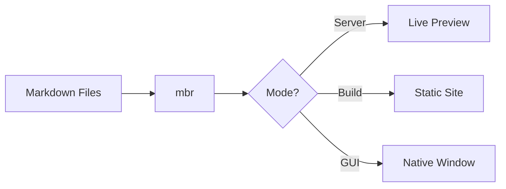

# mbr

### Markdown Browser

*Browse, preview, and publish your markdown — instantly*

>>> Welcome everyone! Today I'm introducing mbr, a tool that makes working with markdown collections effortless.

---

## The Problem

- Markdown files scattered across folders
- No easy way to browse and search
- Static site generators require special structure
- Previewing means context switching

>>> Most tools either require you to restructure your notes or don't provide good navigation. mbr solves this.

---

## The Solution: mbr

**Zero configuration** markdown browsing

```bash
# Preview a file
mbr README.md

# Start a server
mbr -s ~/notes

# Build a static site
mbr -b ~/docs --output ./public
```

>>> Just point mbr at any folder. No config files, no special directory structure, no frontmatter required.

--- {.highlight}

## Key Goals

| Goal | Why It Matters |
|------|----------------|
| **Speed** | Sub-second rendering |
| **No lock-in** | Works with any markdown |
| **Customizable** | Override anything via `.mbr/` |
| **Rich content** | Videos, audio, diagrams |
| **Zero dependencies** | Single binary |

>>> These goals drive every decision. Performance is critical — this tool may be used on repos with tens of thousands of files.

---

## Rich Markdown Extensions

- **Tables** and **footnotes**
- ~~Strikethrough~~ and task lists
- Math: $E = mc^2$
- Mermaid diagrams
- GitHub-style alerts
- Wikilinks: `[[Other Document]]`

>>> All standard pulldown-cmark extensions plus our own additions like marginalia and section attributes.

---

## Code Highlighting

```rust
fn main() {
    // Start the server
    let config = Config::default();
    let server = Server::new(config);

    server.serve("./docs").await?;
}
```

```python
# Or use it from Python
import subprocess
subprocess.run(["mbr", "-s", "./notes"])
```

>>> Syntax highlighting works automatically with highlight.js. Over 180 languages supported.

---

## Mermaid Diagrams



>>> Diagrams render automatically. No configuration needed.

---

## Media Embeds

Standard image syntax works with any media:

```markdown


```

Videos use HTML5 video with full controls.

>>> The magic is in making the simple syntax "just work" for all media types.

--- {#customization}

## Customization

Override anything in `.mbr/`:

```
your-repo/
├── .mbr/
│   ├── config.toml    # Settings
│   ├── theme.css      # Colors
│   ├── user.css       # Your styles
│   └── index.html     # Templates
└── docs/
    └── *.md
```

>>> Users can customize everything without forking. The `.mbr/` folder travels with your repo.

---

## Speaker Notes

Use triple blockquotes for presenter notes:

```markdown
## My Slide

Content the audience sees.

>>> Notes only the presenter sees.
>>> Press 'S' to open the speaker view!
```

>>> Like these notes you're reading right now! Press 'S' to see them in a separate window.

---

## Slide Attributes

Add custom attributes to any slide:

```markdown
--- {#intro .dark-bg data-transition="zoom"}

This slide has custom ID, class, and transition.
```

Useful for styling and Reveal.js transitions.

>>> Section attributes work for both slides and regular documents.

---

## Getting Started

```bash
# Install (coming soon to package managers)
cargo install mbr

# Browse your notes
mbr -s ~/notes

# Build for deployment
mbr -b ~/docs --output ./site
```

>>> That's it! No npm, no config files, no build steps. Just run it.

--- {#thanks .centered}

## Thank You!

**mbr** — Markdown, browsed right.

- GitHub: `github.com/user/mbr`
- Docs: Built with mbr, of course!

>>> Thank you for your attention! Questions?
