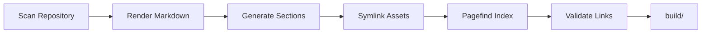

# Static Site Generation

Build mode generates a complete static website that can be deployed to any hosting platform.

## Basic Usage

```bash
# Build to ./build/ directory
mbr -b /path/to/notes

# Build to custom directory
mbr -b --output ./public /path/to/notes
```

## Build Process



### 1. Scan Repository

mbr scans all markdown files, extracting:
- File paths and names
- YAML frontmatter metadata
- Directory structure

### 2. Render Markdown

Each markdown file becomes an HTML page:
- `README.md` → `README/index.html`
- `docs/guide.md` → `docs/guide/index.html`

### 3. Generate Section Pages

Directories get index pages listing their contents:
- Files with titles and descriptions
- Subdirectory links
- Breadcrumb navigation

### 4. Symlink Assets

Static assets (images, PDFs, videos) are symlinked rather than copied:

```
build/images/ → ../images/
```

> **Note**: Symlinks require Unix-like systems (macOS, Linux). Windows is not currently supported for static builds.

### 5. Pagefind Index

mbr generates a [Pagefind](https://pagefind.app/) search index:

```
build/.mbr/pagefind/
├── pagefind.js
├── pagefind-ui.js
├── pagefind-ui.css
└── *.pf_*  # Index files
```

Search works entirely client-side with no server required.

### 6. Validate Links

mbr checks all internal links and reports broken references:

```
Warning: Broken link found
  Source: /docs/guide/index.html
  Target: /docs/missing-page/
```

## Output Structure

```
build/
├── index.html              # Home page
├── README/
│   └── index.html          # README.md rendered
├── docs/
│   ├── index.html          # Directory listing
│   └── guide/
│       └── index.html      # docs/guide.md
├── images/ → ../images     # Symlinked assets
└── .mbr/
    ├── site.json           # Site metadata
    ├── theme.css           # Styling
    ├── pagefind/           # Search index
    └── *.js                # Components
```

## Deployment

### GitHub Pages

See [Integration](../integration/) for a complete GitHub Actions workflow.

Quick setup:

1. Build: `mbr -b --output ./docs /path/to/notes`
2. Enable GitHub Pages in repository settings
3. Select `/docs` folder as source

### Netlify

```toml
# netlify.toml
[build]
  publish = "build"
  command = "mbr -b ."
```

### Any Static Host

The `build/` folder contains plain HTML/CSS/JS that works anywhere:

- Amazon S3 + CloudFront
- Cloudflare Pages
- Vercel
- Firebase Hosting
- Any web server (nginx, Apache)

## Search Configuration

Pagefind search is automatically configured and works out of the box.

### Search Features

- **Instant results**: Searches as you type
- **Fuzzy matching**: Finds close matches
- **Heading navigation**: Results link to specific sections
- **Mobile friendly**: Works on all devices

### Customizing Search

Pagefind respects data attributes in your HTML. Advanced customization is available through Pagefind's configuration options.

## Build Performance

mbr is optimized for fast builds:

- Parallel rendering with Tokio
- Efficient file scanning with rayon
- Symlinks instead of copies for assets

Typical performance:
- ~100 files: < 1 second
- ~1,000 files: 2-5 seconds
- ~10,000 files: 10-30 seconds

## Incremental Builds

mbr does not currently support incremental builds. Each build regenerates all files.

For faster iteration during development, use server mode (`mbr -s`) instead.

## Troubleshooting

### Windows Not Supported

Static site generation uses symlinks, which require administrator privileges on Windows. Use WSL (Windows Subsystem for Linux) instead:

```bash
# In WSL
mbr -b /mnt/c/Users/you/notes
```

### Broken Links Reported

If mbr reports broken links:

1. Check that the target file exists
2. Verify the link path is correct (case-sensitive on Linux)
3. Ensure the file has a recognized markdown extension

### Large Asset Files

For repositories with large assets (videos, etc.):

1. Assets are symlinked, not copied
2. Deployment may need to handle symlinks specially
3. Consider using a CDN for large media files

### Build Output Too Large

If the build output is unexpectedly large:

1. Check for accidentally included directories
2. Use `ignore_dirs` in configuration
3. Verify symlinks are being created (not copies)
