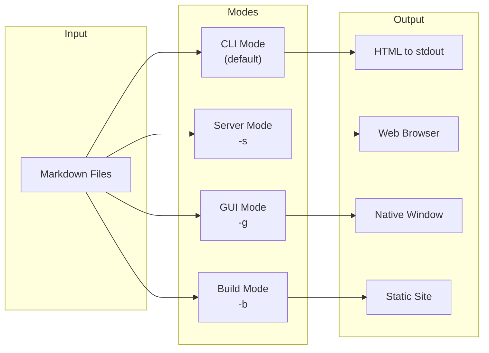

# Modes of Operation

mbr offers four distinct modes, each optimized for different workflows.

## Mode Overview



## Mode Comparison

| Mode | Flag | Use Case | Live Reload | Search |
|------|------|----------|-------------|--------|
| CLI | (none) | Pipe to tools, scripts | No | No |
| Server | `-s` | Development, browsing | Yes | Yes (Live grep) |
| GUI | `-g` | Desktop app experience | Yes | Yes (Live grep) |
| Build | `-b` | Deploy to static hosts | N/A | Yes (Pagefind) |

## Choosing a Mode

### Use CLI Mode When...

- Piping markdown to other tools
- Generating HTML in scripts
- Single-file processing

```bash
mbr document.md > output.html
mbr document.md | pbcopy  # Copy to clipboard (macOS)
```

### Use Server Mode When...

- Writing with live preview
- Browsing large repositories
- Sharing locally with a team
- Hosting on a server where you want a more dynamic output (instead of periodically building and deploying)

```bash
mbr -s ~/notes
# Open http://127.0.0.1:5200/
```

### Use GUI Mode When...

- You want a native app experience
- Using keyboard shortcuts extensively
- Prefer a dedicated window

```bash
mbr -g ~/notes
```

### Use Build Mode When...

- Deploying to GitHub Pages, Netlify, etc.
- Creating a static archive
- Publishing documentation

```bash
mbr -b --output ./public ~/notes
```

## Detailed Guides

- [GUI Mode](gui/) - Native window with menus and shortcuts
- [Server Mode](server/) - Web server with live reload
- [Build Mode](build/) - Static site generation
- [QuickLook](quicklook/) - macOS Finder preview integration
