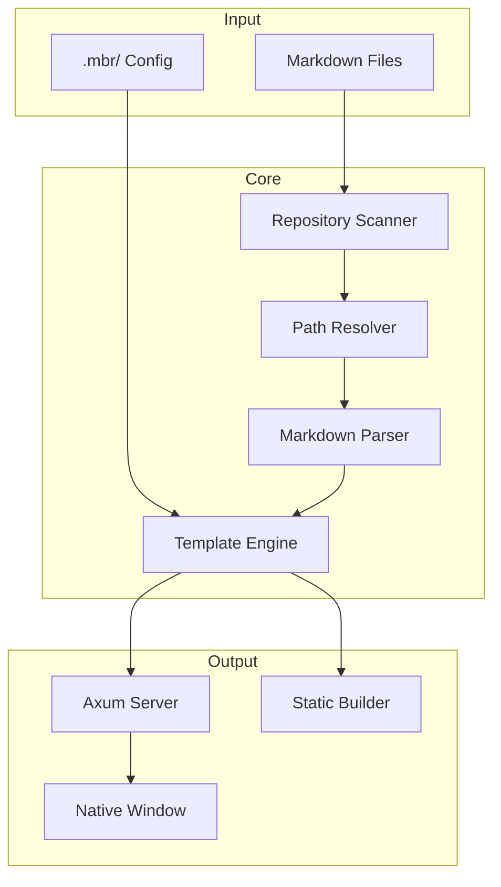
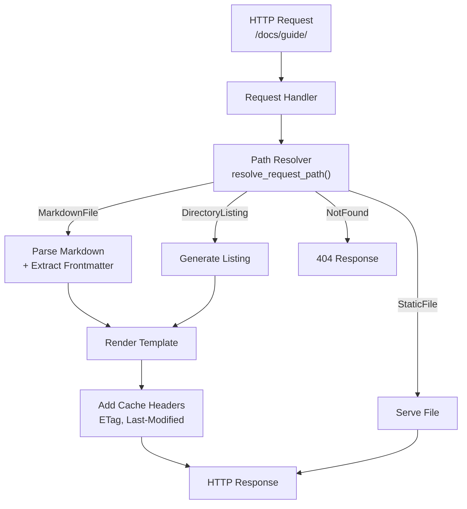

# Architecture

This document provides a technical overview of mbr's architecture, design decisions, and implementation details.

## High-Level Overview



## Rust Modules

| Module | Purpose |
|--------|---------|
| `main.rs` | Entry point, CLI mode selection |
| `cli.rs` | Command-line argument parsing (clap) |
| `config.rs` | Configuration loading (figment) |
| `server.rs` | HTTP server (axum) |
| `build.rs` | Static site generator |
| `browser.rs` | Native GUI window (wry/tao) |
| `path_resolver.rs` | URL to file path resolution |
| `markdown.rs` | Markdown parsing (pulldown-cmark) |
| `templates.rs` | Template rendering (tera) |
| `repo.rs` | Repository scanning |
| `vid.rs` | Video shortcode handling |
| `oembed.rs` | URL metadata extraction |
| `quicklook.rs` | macOS QuickLook extension |
| `errors.rs` | Error type definitions |

## Request Flow



### Path Resolution

The `ResolvedPath` enum represents resolution outcomes:

```rust
enum ResolvedPath {
    MarkdownFile(PathBuf),
    StaticFile(PathBuf),
    DirectoryListing(PathBuf),
    NotFound,
}
```

Resolution order:
1. Direct file match → StaticFile
2. Directory + index file → MarkdownFile
3. Path with `/` suffix matching `.md` file → MarkdownFile
4. File in static folder → StaticFile
5. Directory without index → DirectoryListing
6. Nothing matches → NotFound

## Design Decisions

### On-the-Fly Rendering

mbr renders markdown on every request rather than using caches:

**Rationale:**
- Simplifies code (no cache invalidation)
- Guarantees fresh content
- Modern CPUs render markdown instantly
- HTTP caching handles repeated requests

**Performance:**
- pulldown-cmark uses SIMD for fast parsing
- Typical render: < 5ms for large files
- Browser caching prevents redundant requests

### No Temp Files

mbr never writes to the filesystem during normal operation:

**Rationale:**
- Clean operation (no cleanup needed)
- Works on read-only filesystems
- No permission issues
- Predictable behavior

**Exception:** Static build mode writes to output directory.

### Symlinks for Assets

Static builds use symlinks instead of copying assets:

**Rationale:**
- Faster builds (no large file copies)
- Saves disk space
- Preserves file modification times
- Reflects source changes

**Limitation:** Requires Unix-like OS (macOS, Linux).

### Parallel Scanning

Repository scanning uses rayon for parallelism:

```rust
// Parallel directory traversal
files.par_iter().for_each(|file| {
    // Process each file concurrently
});
```

**Benefits:**
- Near-linear scaling with CPU cores
- Fast initial load for large repos
- Non-blocking server startup

### Template Fallback Chain

Templates resolve through a layered system:

```
1. --template-folder flag
2. .mbr/ folder in repo
3. Compiled-in defaults
```

Each layer can override specific files while inheriting others.

## Performance Goals

mbr prioritizes speed in these areas:

| Area | Goal | Approach |
|------|------|----------|
| Server startup | < 1 second | Lazy initialization |
| Page render | < 50ms | SIMD markdown, in-memory template caching |
| Site build | < 1 file/ms | Parallel rendering |
| Static page load | < 100ms | Minimal JS, client caching |

### Optimization Techniques

**Lazy Loading:**
- File watcher spawns in background
- Site index builds asynchronously
- Templates compile on first use

**Concurrent Processing:**
- rayon for CPU-bound work
- tokio for async I/O
- papaya for lock-free data structures

**Efficient Data Structures:**
- Lock-free concurrent hash maps
- Lazy-compiled regexes
- String interning for paths

## Key Dependencies

| Crate | Purpose |
|-------|---------|
| axum | HTTP server framework |
| tokio | Async runtime |
| pulldown-cmark | Markdown parsing |
| tera | Template engine |
| figment | Configuration management |
| wry | WebView wrapper |
| tao | Window management |
| muda | Native menu bar |
| rayon | Parallel iteration |
| papaya | Concurrent hash maps |
| proptest | Property-based testing |

## Error Handling

mbr uses custom error types with thiserror:

```rust
#[derive(thiserror::Error, Debug)]
pub enum MbrError {
    #[error("Configuration error: {0}")]
    Config(#[from] ConfigError),

    #[error("Build error: {0}")]
    Build(#[from] BuildError),

    #[error("IO error: {0}")]
    Io(#[from] std::io::Error),
}
```

Errors propagate with context using anyhow in appropriate places.

## Testing Strategy

| Type | Location | Purpose |
|------|----------|---------|
| Unit tests | `src/*/tests` | Module behavior |
| Property tests | `src/*/proptests` | Invariant verification |
| Integration tests | `tests/` | HTTP endpoint testing |
| Doc tests | Inline | Example correctness |

### Property-Based Testing

Key invariants verified with proptest:

- Path resolution is deterministic
- Breadcrumb generation never panics
- URL paths are always valid
- Config parsing handles edge cases

## Future Considerations

### Potential Optimizations

- Incremental builds for large sites
- WebSocket-based hot module replacement
- Service worker for offline access
- HTTP/2 push for related assets

### Extensibility Points

- Custom markdown extensions via plugins
- User-defined shortcodes
- External search backends
- CI/CD integrations
