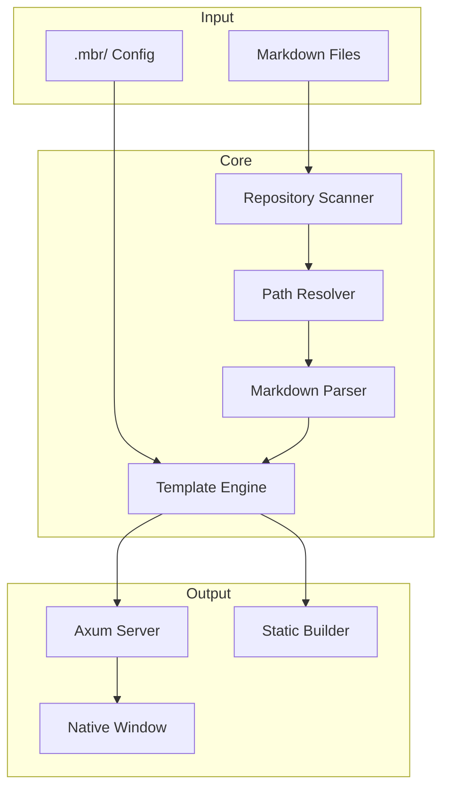
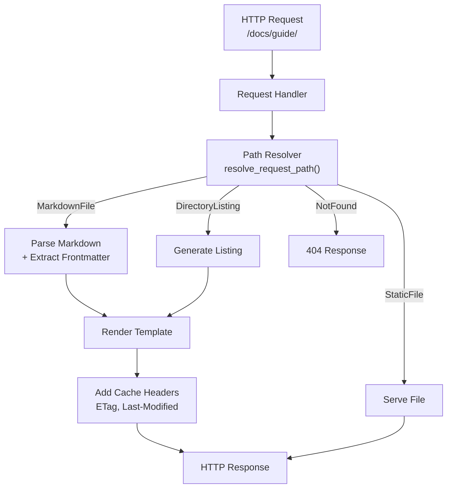

# Architecture

This document provides a technical overview of mbr's architecture, design decisions, and implementation details.

## High-Level Overview


```mermaid
flowchart TD
    subgraph Input
        FILES[Markdown Files]
        CONFIG[.mbr/ Config]
    end

    subgraph Core
        SCANNER[Repository Scanner]
        PARSER[Markdown Parser]
        RESOLVER[Path Resolver]
        TMPL[Template Engine]
    end

    subgraph Output
        SERVER[Axum Server]
        BUILD[Static Builder]
        GUI[Native Window]
    end

    FILES --> SCANNER
    CONFIG --> TMPL
    SCANNER --> RESOLVER
    RESOLVER --> PARSER
    PARSER --> TMPL
    TMPL --> SERVER
    TMPL --> BUILD
    SERVER --> GUI
```

## Rust Modules

| Module | Purpose |
|--------|---------|
| `main.rs` | Entry point, CLI mode selection |
| `cli.rs` | Command-line argument parsing (clap) |
| `config.rs` | Configuration loading (figment) |
| `server.rs` | HTTP server (axum) |
| `build.rs` | Static site generator |
| `browser.rs` | Native GUI window (wry/tao) |
| `path_resolver.rs` | URL to file path resolution |
| `markdown.rs` | Markdown parsing (pulldown-cmark) |
| `templates.rs` | Template rendering (tera) |
| `repo.rs` | Repository scanning |
| `vid.rs` | Video shortcode handling |
| `oembed.rs` | URL metadata extraction |
| `quicklook.rs` | macOS QuickLook extension - markdown rendering plus verbatim plain-text/source previews |
| `errors.rs` | Error type definitions |

## Request Flow


```mermaid
flowchart TD
    REQ["HTTP Request<br/>/docs/guide/"] --> HANDLER[Request Handler]
    HANDLER --> RESOLVER["Path Resolver<br/>resolve_request_path()"]

    RESOLVER --> |MarkdownFile| PARSE["Parse Markdown<br/>+ Extract Frontmatter"]
    RESOLVER --> |StaticFile| SERVE[Serve File]
    RESOLVER --> |DirectoryListing| LIST[Generate Listing]
    RESOLVER --> |NotFound| E404[404 Response]

    PARSE --> RENDER[Render Template]
    LIST --> RENDER
    RENDER --> CACHE["Add Cache Headers<br/>ETag, Last-Modified"]
    CACHE --> RESP[HTTP Response]
    SERVE --> RESP
```

### Path Resolution

The `ResolvedPath` enum represents resolution outcomes:

```rust
enum ResolvedPath {
    MarkdownFile(PathBuf),
    StaticFile(PathBuf),
    DirectoryListing(PathBuf),
    NotFound,
}
```

Resolution order:
1. Direct file match → StaticFile
2. Directory + index file → MarkdownFile
3. Path with `/` suffix matching `.md` file → MarkdownFile
4. File in static folder → StaticFile
5. Directory without index → DirectoryListing
6. Nothing matches → NotFound

## Links and URL Conventions

### One canonical URL per page

A markdown page is served at exactly one URL — the directory-style one:

| File | Canonical URL |
|------|---------------|
| `docs/guide.md` | `/docs/guide/` |
| `docs/index.md` | `/docs/` |
| `README.md` | `/README/` |

The trailing slash is load-bearing, not cosmetic. It decides the base a browser
uses for the page's own relative links: from `/docs/guide/` a `../other/` href
resolves to `/docs/other/`, but from `/docs/guide` it resolves to `/other/`.
Serving a page at the slashless URL therefore breaks every relative link *on
that page* — one click after the wrong URL, which is what makes the symptom so
hard to trace.

Server and GUI mode answer any non-canonical spelling — `/docs/guide`,
`/docs/guide.md`, `/docs`, `/docs/index/` — with a `301` to the canonical URL,
preserving the query string. Fragments are not echoed in `Location`, because
per RFC 9110 §10.2.2 the client reapplies the original one. Static files and
directory listings are never redirected.

Static builds have no server, so the redirect cannot save them: there the
correct href has to be emitted at render time, and the build's link checker
reports any that are not (see [Build Mode](../modes/build/)).

### Link transformation

`link_transform::transform_link` rewrites each authored href for the
trailing-slash convention:

| Authored in `docs/guide.md` | Emitted href | Lands on |
|------|------|------|
| `other.md` | `../other/` | `/docs/other/` |
| `other` | `../other/` | `/docs/other/` |
| `other/` | `../other/` | `/docs/other/` |
| `subfolder/index.md` | `../subfolder/` | `/docs/subfolder/` |
| `../folder/file.md` | `../../folder/file/` | `/folder/file/` |
| `photo.png` | `../photo.png` | `/docs/photo.png` |
| `Makefile` | `../Makefile` | `/docs/Makefile` |
| `/docs/other/` | unchanged (server) | `/docs/other/` |
| `https://…`, `mailto:…` | unchanged | off-site |

The extra `../` on non-index pages compensates for the trailing slash; index
pages already sit at a directory URL and get none.

An **extension-less** target is ambiguous — `../folder/file` could be a markdown
page or a file literally named `file`. Guessing either way corrupts the other
(`LICENSE`, `Makefile`, `Dockerfile` are real, common link targets), so mbr asks
the repository through the same path resolver a live request uses. Contexts with
no repository — CLI and QuickLook rendering — treat an extension-less target as
a static file.

### Link validation

| Mode | Where | What it reads |
|------|-------|---------------|
| Server / GUI | `GET /{page}/errors.json` (`page_errors.rs`) | Every `<a href>` in the **rendered** HTML |
| Build | after rendering (`build.rs::validate_links`) | Every `<a href>` in the **generated** HTML |

Both read the href that was actually emitted rather than re-deriving one from
the markdown source: a checker that re-derives re-applies the same rules the
transform used, so a transform defect is invisible to it by construction. Both
report three kinds of problem — a target that does not exist, a page link
missing its trailing slash, and a `../` chain that escapes the repository root
(which browsers silently clamp).

Links into mbr's own `/.mbr/` namespace are skipped in server/GUI mode: the
media viewers (`/.mbr/videos/?path=…` and friends) and the JSON endpoints are
axum routes with no file behind them, and `/.mbr/theme.css`-style assets fall
back to the compiled-in defaults when the repository has no `.mbr/` folder. The
path resolver never sees any of it, so its verdict would be a 404 claim about a
URL that serves 200. A static build has no such gap — it writes that whole tree
itself, so those files are checked like any other.

## Design Decisions

### On-the-Fly Rendering

mbr renders markdown on every request rather than using caches:

**Rationale:**
- Simplifies code (no cache invalidation)
- Guarantees fresh content
- Modern CPUs render markdown instantly
- HTTP caching handles repeated requests

**Performance:**
- pulldown-cmark uses SIMD for fast parsing
- Typical render: < 5ms for large files
- Browser caching prevents redundant requests

### No Temp Files

mbr never writes to the filesystem during normal operation:

**Rationale:**
- Clean operation (no cleanup needed)
- Works on read-only filesystems
- No permission issues
- Predictable behavior

**Exception:** Static build mode writes to output directory.

### Symlinks for Assets

Static builds use symlinks instead of copying assets:

**Rationale:**
- Faster builds (no large file copies)
- Saves disk space
- Preserves file modification times
- Reflects source changes

**Limitation:** Requires Unix-like OS (macOS, Linux).

### Parallel Scanning

Repository scanning uses rayon for parallelism:

```rust
// Parallel directory traversal
files.par_iter().for_each(|file| {
    // Process each file concurrently
});
```

**Benefits:**
- Near-linear scaling with CPU cores
- Fast initial load for large repos
- Non-blocking server startup

### Template Fallback Chain

Templates resolve through a layered system:

```
1. --template-folder flag
2. .mbr/ folder in repo
3. Compiled-in defaults
```

Each layer can override specific files while inheriting others.

## Performance Goals

mbr prioritizes speed in these areas:

| Area | Goal | Approach |
|------|------|----------|
| Server startup | < 1 second | Lazy initialization |
| Page render | < 50ms | SIMD markdown, in-memory template caching |
| Site build | < 1 file/ms | Parallel rendering |
| Static page load | < 100ms | Minimal JS, client caching |

### Optimization Techniques

**Lazy Loading:**
- File watcher spawns in background
- Site index builds asynchronously
- Templates compile on first use

**Concurrent Processing:**
- rayon for CPU-bound work
- tokio for async I/O
- papaya for lock-free data structures

**Efficient Data Structures:**
- Lock-free concurrent hash maps
- Lazy-compiled regexes
- String interning for paths

## Key Dependencies

| Crate | Purpose |
|-------|---------|
| axum | HTTP server framework |
| tokio | Async runtime |
| pulldown-cmark | Markdown parsing |
| tera | Template engine |
| figment | Configuration management |
| wry | WebView wrapper |
| tao | Window management |
| muda | Native menu bar |
| rayon | Parallel iteration |
| papaya | Concurrent hash maps |
| proptest | Property-based testing |

## Error Handling

mbr uses custom error types with thiserror:

```rust
#[derive(thiserror::Error, Debug)]
pub enum MbrError {
    #[error("Configuration error: {0}")]
    Config(#[from] ConfigError),

    #[error("Build error: {0}")]
    Build(#[from] BuildError),

    #[error("IO error: {0}")]
    Io(#[from] std::io::Error),
}
```

Errors propagate with context.

## Testing Strategy

| Type | Location | Purpose |
|------|----------|---------|
| Unit tests | `src/*/tests` | Module behavior |
| Property tests | `src/*/proptests` | Invariant verification |
| Integration tests | `tests/` | HTTP endpoint testing |
| Doc tests | Inline | Example correctness |

### Property-Based Testing

Key invariants verified with proptest:

- Path resolution is deterministic
- Breadcrumb generation never panics
- URL paths are always valid
- Config parsing handles edge cases

## Future Considerations

### Potential Optimizations

- Incremental builds for large sites
- WebSocket-based hot module replacement
- Service worker for offline access
- HTTP/2 push for related assets

### Extensibility Points

- Custom markdown extensions via plugins
- User-defined shortcodes
- External search backends
- CI/CD integrations
