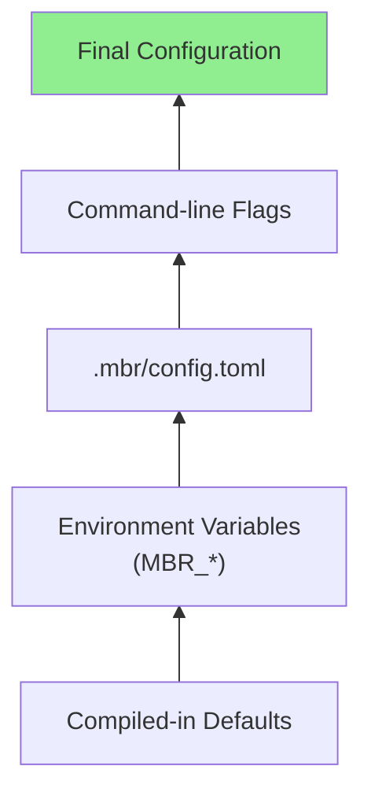

# CLI Reference

Complete reference for mbr's command-line interface and configuration options.

## Usage

```bash
mbr [OPTIONS] [PATH]
```

If `PATH` is omitted, mbr uses the current directory.

## Mode Flags

These flags are mutually exclusive:

| Flag | Description |
|------|-------------|
| (none) | Render markdown to stdout |
| `-s, --server` | Start web server |
| `-g, --gui` | Launch native GUI window |
| `-b, --build` | Generate static site |
| `--extract-video-metadata` | Extract video metadata to sidecar files (requires `media-metadata` feature) |

## Options

| Option | Description | Default |
|--------|-------------|---------|
| `--output <PATH>` | Output directory for static build | `build` |
| `--template-folder <PATH>` | Custom template folder | (uses `.mbr/`) |
| `--oembed-timeout-ms <MS>` | Timeout for URL metadata fetch (0 to disable) | `500` (server/GUI), `0` (build) |
| `--oembed-cache-size <BYTES>` | Max oembed cache size (0 to disable) | `2097152` (2MB) |
| `--build-concurrency <N>` | Files to process in parallel during build | auto (2x cores, max 32) |
| `--skip-link-checks` | Skip internal link validation during build | `false` |
| `--no-link-tracking` | Disable bidirectional link tracking | `false` |
| `--transcode` | [EXPERIMENTAL] Enable dynamic video transcoding (server/GUI mode only) | `false` |
| `--transcode-max-size <MB>` | Skip transcoding for files larger than this | `500` |
| `-v, --verbose` | Increase log verbosity | warn level |
| `-q, --quiet` | Suppress output except errors | |
| `--help` | Print help message | |
| `--version` | Print version | |

### Verbosity Levels

| Flag | Level |
|------|-------|
| (none) | warn |
| `-v` | info |
| `-vv` | debug |
| `-vvv` | trace |

The `RUST_LOG` environment variable overrides these flags.

## Examples

```bash
# Render single file to stdout
mbr README.md

# Start server on default port
mbr -s ~/notes

# Start server with debug logging
mbr -s -vv ~/notes

# Launch GUI window
mbr -g ~/notes

# Build static site
mbr -b ~/notes

# Build to custom directory
mbr -b --output ./public ~/notes

# Use custom template folder
mbr -s --template-folder ./my-theme ~/notes

# Increase oembed timeout
mbr -s --oembed-timeout-ms 2000 ~/notes

# Disable oembed fetching (uses plain links)
mbr -s --oembed-timeout-ms 0 ~/notes
```

---

# Configuration

mbr uses a layered configuration system:



Later layers override earlier ones.

## Configuration File

Create `.mbr/config.toml` in your markdown repository:

```toml
# .mbr/config.toml

# Server settings
ip = "127.0.0.1"
port = 5200

# Markdown settings
markdown_extensions = ["md", "markdown"]
index_file = "index.md"

# Static file folder (relative to repo root)
static_folder = "static"

# Directories to ignore during scanning
ignore_dirs = [
    "target",
    "node_modules",
    ".git",
    "build",
    "dist"
]

# File patterns to ignore
ignore_globs = [
    "*.log",
    "*.bak",
    "*.tmp"
]

# Directories ignored by file watcher (live reload)
watcher_ignore_dirs = [
    ".direnv",
    ".git",
    "target"
]

# oEmbed/OpenGraph fetch timeout in milliseconds (server/GUI default: 500)
# Note: Build mode defaults to 0 (disabled) for performance. Override with CLI if needed.
oembed_timeout_ms = 500

# Enable write operations (future feature)
enable_writes = false
```

## Configuration Options

### Server Settings

| Option | Type | Default | Description |
|--------|------|---------|-------------|
| `ip` | string | `"127.0.0.1"` | IP address to bind |
| `port` | number | `5200` | Port number |

### Content Settings

| Option | Type | Default | Description |
|--------|------|---------|-------------|
| `markdown_extensions` | array | `["md"]` | File extensions treated as markdown |
| `index_file` | string | `"index.md"` | Default file for directories |
| `static_folder` | string | `"static"` | Folder for static file overlay |

### Ignore Settings

| Option | Type | Default | Description |
|--------|------|---------|-------------|
| `ignore_dirs` | array | (see below) | Directories to skip |
| `ignore_globs` | array | (see below) | File patterns to ignore |
| `watcher_ignore_dirs` | array | (see below) | Dirs ignored by file watcher |

**Default ignored directories:**
```
target, result, build, node_modules, ci, templates, .git, .github, dist, out, coverage
```

**Default ignored globs:**
```
*.log, *.bak, *.lock, *.sh, *.css, *.scss, *.js, *.ts
```

### Behavior Settings

| Option | Type | Default | Description |
|--------|------|---------|-------------|
| `oembed_timeout_ms` | number | `500` (server/GUI), `0` (build) | URL metadata fetch timeout (0 to disable) |
| `oembed_cache_size` | number | `2097152` | Cache size in bytes (0 to disable) |
| `skip_link_checks` | bool | `false` | Skip internal link validation during builds |
| `link_tracking` | bool | `true` | Enable bidirectional link tracking (backlinks) |
| `enable_writes` | bool | `false` | Allow write operations |

> **Note:** Setting `oembed_timeout_ms` to `0` disables OpenGraph fetching entirely, rendering bare URLs as plain links. YouTube and Giphy embeds still work since they don't require network calls.

> **Note:** The oembed cache stores fetched page metadata to avoid redundant network requests. URLs are fetched in parallel and cached for reuse across files (in build mode) or requests (in server mode). Set `oembed_cache_size` to `0` to disable caching.

### Build Mode Performance

By default, static builds (`-b`) disable oembed fetching (`oembed_timeout_ms=0`). If you want rich link previews in your static site, you can enable it by specifying a timeout:

```bash
mbr -b --oembed-timeout-ms 500 ~/notes
```

Oembed fetching is parallelized and cached, so the overhead is minimal even for large repositories.

### Parallel Building

Static builds process markdown files in parallel for maximum speed:

| Setting | Effect |
|---------|--------|
| Default (auto) | Uses 2x CPU cores, capped at 32 |
| `--build-concurrency 1` | Sequential processing (useful for debugging) |
| `--build-concurrency 16` | Explicit concurrency limit |

Memory usage scales with concurrency. Use lower values if running out of memory on very large repositories.

### Link Validation

By default, static builds validate all internal links (links to other pages within the site) and report broken ones. To skip this check for faster builds:

```bash
mbr -b --skip-link-checks ~/notes
```

Or in `.mbr/config.toml`:
```toml
skip_link_checks = true
```

### Link Tracking (Backlinks)

mbr automatically tracks bidirectional links between pages. The info panel (Ctrl+g) shows both:
- **Links Out**: Pages this document links to
- **Links In**: Pages that link to this document (backlinks)

This feature enables wiki-style backlink navigation without requiring any special syntax.

**How it works:**

| Mode | Method | Performance |
|------|--------|-------------|
| Server/GUI | On-demand grep search (cached) | First request: ~1-3s, subsequent: instant |
| Build | Eager index during render | Computed in parallel, no runtime cost |

**API:** Each page has a `links.json` endpoint:
```bash
# Server mode
curl http://localhost:5200/docs/guide/links.json

# Static build
cat build/docs/guide/links.json
```

Response format:
```json
{
  "inbound": [
    {"from": "/other/page/", "text": "link text", "anchor": "#section"}
  ],
  "outbound": [
    {"to": "/another/page/", "text": "link text", "anchor": "#section", "internal": true}
  ]
}
```

**Disable link tracking:**
```bash
mbr -s --no-link-tracking ~/notes
```

Or in `.mbr/config.toml`:
```toml
link_tracking = false
```

When disabled, the `links.json` endpoint returns 404 and no link files are generated during builds.

### Video Metadata Extraction

> **Note:** This feature requires the `media-metadata` Cargo feature to be enabled at compile time.

mbr can extract video metadata (cover images, chapters, and captions) from video files. This works in two ways:

**Server Mode (Dynamic Generation):**
When running with `-s` or `-g`, mbr automatically generates metadata files on-the-fly when they don't exist on disk. Request any of these special paths to trigger generation:

| Pattern | Description |
|---------|-------------|
| `{video}.cover.png` | Cover image (frame captured at 5 seconds, or earlier for short videos) |
| `{video}.chapters.en.vtt` | Chapter markers in WebVTT format |
| `{video}.captions.en.vtt` | Subtitles/captions in WebVTT format |

Example: If you have `videos/demo.mp4`, requesting `/videos/demo.mp4.cover.png` will dynamically extract and return a cover image.

Generated metadata is cached in memory to avoid repeated ffmpeg operations.

**CLI Mode (Pre-generation):**
Use `--extract-video-metadata` to extract metadata and save as sidecar files:

```bash
# Extract metadata from a single video
mbr --extract-video-metadata ~/videos/demo.mp4

# Output:
# Analyzing video: /Users/you/videos/demo.mp4
#   Duration: 120.5s, Chapters: yes, Subtitles: no
# + Created: /Users/you/videos/demo.mp4.cover.png
# + Created: /Users/you/videos/demo.mp4.chapters.en.vtt
# - No captions found in video
```

This is useful for pre-generating metadata for static site builds or when you want the files persisted to disk.

### Video Transcoding (EXPERIMENTAL)

> **Note:** This feature requires the `media-metadata` Cargo feature to be enabled at compile time.

> ⚠️ **EXPERIMENTAL** - This feature is new and feedback is welcome! Please report issues or suggestions at the project repository.

mbr can dynamically transcode videos to lower resolutions (720p, 480p) using HLS (HTTP Live Streaming) for bandwidth savings on mobile devices and slow connections. This feature only works in server/GUI mode (`-s` or `-g`).

**Enable transcoding:**
```bash
mbr -s --transcode ~/notes
```

**How it works:**
1. When transcoding is enabled, video embeds include multiple `<source>` tags with media queries
2. Desktop browsers (viewport >= 1280px) load the original MP4 directly
3. Tablets (viewport >= 640px) use HLS 720p playlist (Safari only)
4. Mobile devices use HLS 480p playlist (Safari only)
5. Non-Safari browsers fall back to the original MP4 (HLS requires JavaScript in Chrome/Firefox)
6. HLS segments (~10 seconds each) are transcoded on-demand and cached

**URL patterns:**
| Type | Example |
|------|---------|
| Original video | `/videos/demo.mp4` |
| 720p HLS playlist | `/videos/demo-720p.m3u8` |
| 720p HLS segment | `/videos/demo-720p-005.ts` |
| 480p HLS playlist | `/videos/demo-480p.m3u8` |

**Browser compatibility:**
| Browser | HLS Support | Behavior |
|---------|-------------|----------|
| Safari (macOS/iOS) | Native | Uses HLS variants on mobile/tablet |
| Chrome/Firefox/Edge | None | Falls back to original MP4 |

**Hardware acceleration:**
Transcoding automatically uses hardware encoders when available:
- macOS: VideoToolbox (`h264_videotoolbox`)
- Linux: NVIDIA (`h264_nvenc`), AMD (`h264_amf`), Intel (`h264_qsv`), VAAPI
- Fallback: Software encoding (`libx264`)

**Configuration:**
| Option | Type | Default | Description |
|--------|------|---------|-------------|
| `transcode` | bool | `false` | Enable dynamic video transcoding via HLS |

**Memory usage:**
HLS segments and playlists are cached in memory (~200MB max by default). Each segment is approximately:
- 720p segment (10s @ 2.5 Mbps): ~3 MB
- 480p segment (10s @ 1.0 Mbps): ~1.25 MB
- Playlist: ~1-2 KB (negligible)

Cache evicts oldest segments when full, prioritizing keeping playlists cached.

**When to use:**
- Serving videos to Safari users on mobile devices
- Reducing bandwidth usage for remote viewers on iOS/macOS
- Fast video startup (only first segment needs to transcode)

**When NOT to use:**
- Local browsing on the same machine (default: off)
- Users primarily on Chrome/Firefox (they get original MP4 anyway)
- Static site generation (transcoding is server-only)

## Environment Variables

> [!CAUTION]
> There are good reasons to allow this behavior, but in general, please don't use environment variables for configs. It's very easy to get unexpected behavior as you forget about the silent inputs from the environment.

Every configuration option can be set via environment variable with the `MBR_` prefix:

```bash
# Server settings
MBR_IP=0.0.0.0
MBR_PORT=3000

# Content settings
MBR_STATIC_FOLDER=assets
MBR_INDEX_FILE=README.md

# Behavior
MBR_OEMBED_TIMEOUT_MS=1000
MBR_OEMBED_CACHE_SIZE=4194304  # 4MB

# Video transcoding (requires media-metadata feature)
MBR_TRANSCODE=true
MBR_TRANSCODE_MAX_SIZE=500  # MB
```

Environment variables override config file settings.


## Root Directory Detection

mbr automatically finds the repository root by searching upward for common repository markers:

**Directory markers** (searched first, in order):

| Marker | Description |
|--------|-------------|
| `.mbr/` | mbr configuration folder (highest priority) |
| `.git/` | Git repository |
| `.zk/` | Zettlekasten notes |
| `.obsidian/` | Obsidian vault |

**File markers** (searched if no directory markers found):

| Marker | Description |
|--------|-------------|
| `book.toml` | mdBook project |
| `mkdocs.yml` | MkDocs project |
| `docusaurus.config.js` | Docusaurus project |

The search works as follows:

1. Start from the specified path
2. Search upward for directory markers in priority order
3. If no directory markers found, search for file markers
4. First marker found determines the root directory
5. If no markers found, fall back to current working directory (if ancestor) or specified path

This allows running mbr from any subdirectory:

```bash
cd ~/notes/docs/guide
mbr -s .  # Still uses ~/notes/.mbr/config.toml
```

## Static Folder

The `static_folder` setting creates an overlay for serving static files. The default is `static`, meaning files in a `static/` folder at the repo root are served at the root URL path.

```
notes/
├── static/               # Default static folder
│   └── images/
│       └── logo.png      # Available at /images/logo.png
└── docs/
    └── guide.md
```

To use a different folder, configure it in `.mbr/config.toml`:

```toml
static_folder = "assets"
```

In `guide.md`:
```markdown

```

### Path Resolution Order

1. Check if path matches a markdown file
2. Check if path is a directory with index file
3. Check if path matches file in static folder
4. Return 404

## Template Folder

The `--template-folder` flag overrides the default template resolution:

```bash
mbr -s --template-folder ./my-theme ~/notes
```

Files are loaded from this folder first, falling back to compiled-in defaults if not found.

Useful for:
- Theme development
- Testing template changes
- Sharing themes across repositories
