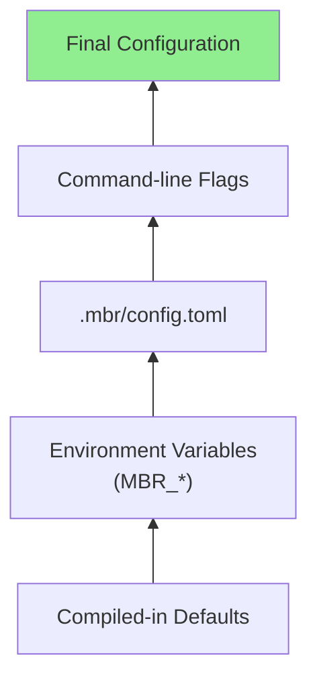

# CLI Reference

Complete reference for mbr's command-line interface and configuration options.

## Usage

```bash
mbr [OPTIONS] [PATH]
```

If `PATH` is omitted, mbr uses the current directory.

## Mode Flags

These flags are mutually exclusive:

| Flag | Description |
|------|-------------|
| (none) | Render markdown to stdout |
| `-s, --server` | Start web server |
| `-g, --gui` | Launch native GUI window |
| `-b, --build` | Generate static site |

## Options

| Option | Description | Default |
|--------|-------------|---------|
| `--output <PATH>` | Output directory for static build | `build` |
| `--template-folder <PATH>` | Custom template folder | (uses `.mbr/`) |
| `--oembed-timeout-ms <MS>` | Timeout for URL metadata fetch (0 to disable) | `500` (server/GUI), `0` (build) |
| `--oembed-cache-size <BYTES>` | Max oembed cache size (0 to disable) | `2097152` (2MB) |
| `--build-concurrency <N>` | Files to process in parallel during build | auto (2x cores, max 32) |
| `-v, --verbose` | Increase log verbosity | warn level |
| `-q, --quiet` | Suppress output except errors | |
| `--help` | Print help message | |
| `--version` | Print version | |

### Verbosity Levels

| Flag | Level |
|------|-------|
| (none) | warn |
| `-v` | info |
| `-vv` | debug |
| `-vvv` | trace |

The `RUST_LOG` environment variable overrides these flags.

## Examples

```bash
# Render single file to stdout
mbr README.md

# Start server on default port
mbr -s ~/notes

# Start server with debug logging
mbr -s -vv ~/notes

# Launch GUI window
mbr -g ~/notes

# Build static site
mbr -b ~/notes

# Build to custom directory
mbr -b --output ./public ~/notes

# Use custom template folder
mbr -s --template-folder ./my-theme ~/notes

# Increase oembed timeout
mbr -s --oembed-timeout-ms 2000 ~/notes

# Disable oembed fetching (uses plain links)
mbr -s --oembed-timeout-ms 0 ~/notes
```

---

# Configuration

mbr uses a layered configuration system:



Later layers override earlier ones.

## Configuration File

Create `.mbr/config.toml` in your markdown repository:

```toml
# .mbr/config.toml

# Server settings
ip = "127.0.0.1"
port = 5200

# Markdown settings
markdown_extensions = ["md", "markdown"]
index_file = "index.md"

# Static file folder (relative to repo root)
static_folder = "static"

# Directories to ignore during scanning
ignore_dirs = [
    "target",
    "node_modules",
    ".git",
    "build",
    "dist"
]

# File patterns to ignore
ignore_globs = [
    "*.log",
    "*.bak",
    "*.tmp"
]

# Directories ignored by file watcher (live reload)
watcher_ignore_dirs = [
    ".direnv",
    ".git",
    "target"
]

# oEmbed/OpenGraph fetch timeout in milliseconds (server/GUI default: 500)
# Note: Build mode defaults to 0 (disabled) for performance. Override with CLI if needed.
oembed_timeout_ms = 500

# Enable write operations (future feature)
enable_writes = false
```

## Configuration Options

### Server Settings

| Option | Type | Default | Description |
|--------|------|---------|-------------|
| `ip` | string | `"127.0.0.1"` | IP address to bind |
| `port` | number | `5200` | Port number |

### Content Settings

| Option | Type | Default | Description |
|--------|------|---------|-------------|
| `markdown_extensions` | array | `["md"]` | File extensions treated as markdown |
| `index_file` | string | `"index.md"` | Default file for directories |
| `static_folder` | string | `"static"` | Folder for static file overlay |

### Ignore Settings

| Option | Type | Default | Description |
|--------|------|---------|-------------|
| `ignore_dirs` | array | (see below) | Directories to skip |
| `ignore_globs` | array | (see below) | File patterns to ignore |
| `watcher_ignore_dirs` | array | (see below) | Dirs ignored by file watcher |

**Default ignored directories:**
```
target, result, build, node_modules, ci, templates, .git, .github, dist, out, coverage
```

**Default ignored globs:**
```
*.log, *.bak, *.lock, *.sh, *.css, *.scss, *.js, *.ts
```

### Behavior Settings

| Option | Type | Default | Description |
|--------|------|---------|-------------|
| `oembed_timeout_ms` | number | `500` (server/GUI), `0` (build) | URL metadata fetch timeout (0 to disable) |
| `oembed_cache_size` | number | `2097152` | Cache size in bytes (0 to disable) |
| `enable_writes` | bool | `false` | Allow write operations |

> **Note:** Setting `oembed_timeout_ms` to `0` disables OpenGraph fetching entirely, rendering bare URLs as plain links. YouTube and Giphy embeds still work since they don't require network calls.

> **Note:** The oembed cache stores fetched page metadata to avoid redundant network requests. URLs are fetched in parallel and cached for reuse across files (in build mode) or requests (in server mode). Set `oembed_cache_size` to `0` to disable caching.

### Build Mode Performance

By default, static builds (`-b`) disable oembed fetching (`oembed_timeout_ms=0`) for maximum performance. This is because oembed fetching can dramatically slow down builds:

| Oembed Setting | Build Time (3,000 notes) |
|----------------|--------------------------|
| `--oembed-timeout-ms 0` (default) | ~12 seconds |
| `--oembed-timeout-ms 1000` | ~10 minutes |

If you want rich link previews in your static site, you can opt-in by specifying a timeout:

```bash
mbr -b --oembed-timeout-ms 500 ~/notes
```

> **Future improvement:** We plan to optimize oembed fetching for static builds by batching and caching more aggressively. For now, we recommend keeping oembed disabled for large repositories and enabling it only for smaller sites where the build time is acceptable.

### Parallel Building

Static builds process markdown files in parallel for maximum speed:

| Setting | Effect |
|---------|--------|
| Default (auto) | Uses 2x CPU cores, capped at 32 |
| `--build-concurrency 1` | Sequential processing (useful for debugging) |
| `--build-concurrency 16` | Explicit concurrency limit |

Memory usage scales with concurrency. Use lower values if running out of memory on very large repositories.

## Environment Variables

> [!CAUTION]
> There are good reasons to allow this behavior, but in general, please don't use environment variables for configs. It's very easy to get unexpected behavior as you forget about the silent inputs from the environment.

Every configuration option can be set via environment variable with the `MBR_` prefix:

```bash
# Server settings
MBR_IP=0.0.0.0
MBR_PORT=3000

# Content settings
MBR_STATIC_FOLDER=assets
MBR_INDEX_FILE=README.md

# Behavior
MBR_OEMBED_TIMEOUT_MS=1000
MBR_OEMBED_CACHE_SIZE=4194304  # 4MB
```

Environment variables override config file settings.


## Root Directory Detection

mbr automatically finds the repository root by searching upward for common repository markers:

**Directory markers** (searched first, in order):

| Marker | Description |
|--------|-------------|
| `.mbr/` | mbr configuration folder (highest priority) |
| `.git/` | Git repository |
| `.zk/` | Zettlekasten notes |
| `.obsidian/` | Obsidian vault |

**File markers** (searched if no directory markers found):

| Marker | Description |
|--------|-------------|
| `book.toml` | mdBook project |
| `mkdocs.yml` | MkDocs project |
| `docusaurus.config.js` | Docusaurus project |

The search works as follows:

1. Start from the specified path
2. Search upward for directory markers in priority order
3. If no directory markers found, search for file markers
4. First marker found determines the root directory
5. If no markers found, fall back to current working directory (if ancestor) or specified path

This allows running mbr from any subdirectory:

```bash
cd ~/notes/docs/guide
mbr -s .  # Still uses ~/notes/.mbr/config.toml
```

## Static Folder

The `static_folder` setting creates an overlay for serving static files. The default is `static`, meaning files in a `static/` folder at the repo root are served at the root URL path.

```
notes/
├── static/               # Default static folder
│   └── images/
│       └── logo.png      # Available at /images/logo.png
└── docs/
    └── guide.md
```

To use a different folder, configure it in `.mbr/config.toml`:

```toml
static_folder = "assets"
```

In `guide.md`:
```markdown

```

### Path Resolution Order

1. Check if path matches a markdown file
2. Check if path is a directory with index file
3. Check if path matches file in static folder
4. Return 404

## Template Folder

The `--template-folder` flag overrides the default template resolution:

```bash
mbr -s --template-folder ./my-theme ~/notes
```

Files are loaded from this folder first, falling back to compiled-in defaults if not found.

Useful for:
- Theme development
- Testing template changes
- Sharing themes across repositories
